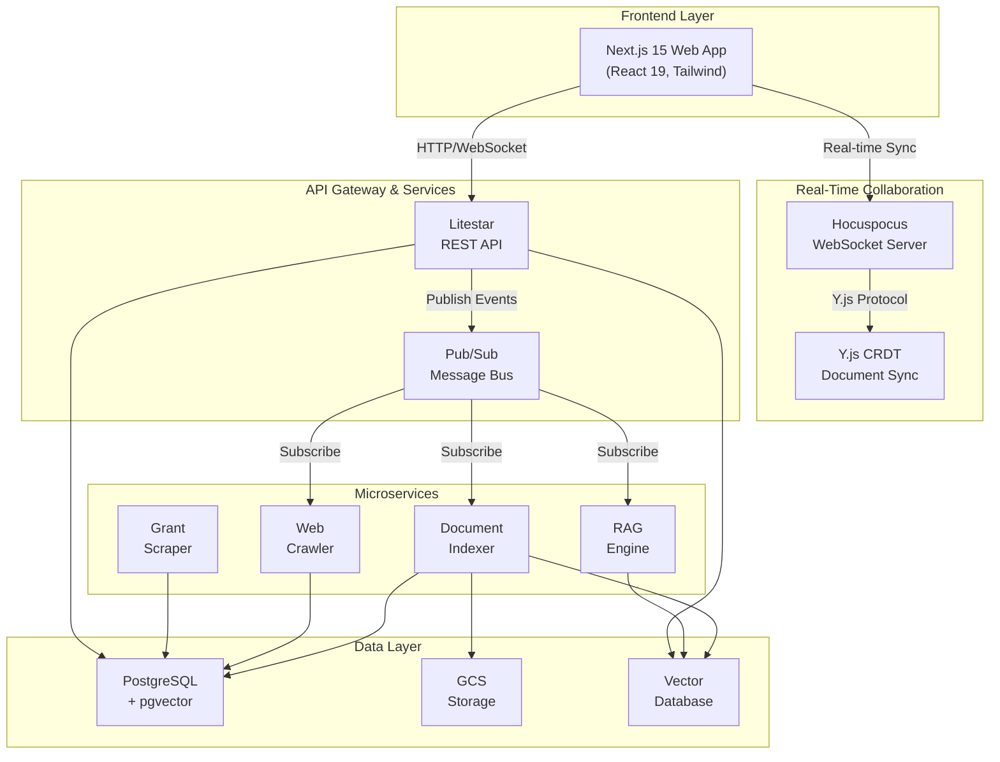
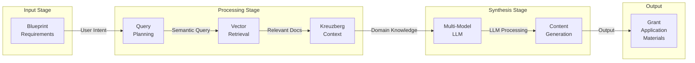
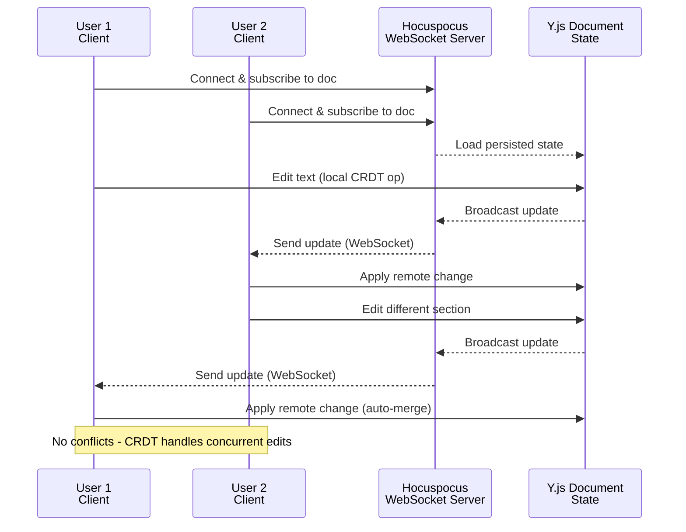

# GrantFlow.AI

Intelligent grant management platform that automates discovery, planning, and application workflows for researchers and institutions.

## What is GrantFlow.AI?

GrantFlow.AI is a comprehensive platform designed to streamline the grant management process. Researchers and institutions can discover relevant grant opportunities, organize collaborative planning, and generate high-quality grant applications—all in one place.

Our platform combines intelligent document processing, real-time collaboration, and AI-powered content generation to transform how teams approach grant management. Whether you're tracking opportunities, coordinating across departments, or drafting applications, GrantFlow.AI provides the tools to work smarter.

## Key Features

- **Intelligent Grant Discovery**: Automated monitoring of grant opportunities with targeted notifications
- **Collaborative Planning**: Real-time document editing with team members using CRDT-based synchronization
- **AI-Powered Generation**: Leverage RAG technology to generate grant applications and materials
- **Document Processing**: Advanced PDF, DOC, and web content extraction with semantic indexing
- **Multi-Tenant Organization Management**: Role-based access and team collaboration
- **Vector-Powered Search**: Semantic search across your documents and grants
- **Integration-Ready**: Built-in support for Discord notifications and custom webhooks

## Architecture

### System Architecture

GrantFlow.AI is built as a full-stack monorepo with a modern frontend, microservices backend, and real-time collaboration layer:

### RAG Pipeline

The Retrieval Augmented Generation pipeline powers intelligent content generation using document context and domain expertise via [Kreuzberg](https://kreuzberg.dev):

### Real-Time Collaboration

Concurrent document editing is powered by CRDT (Conflict-free Replicated Data Type) synchronization with Y.js and Hocuspocus:

## Technology Stack

| Layer | Technology |
|-------|-----------|
| **Frontend** | Next.js 15, React 19, TypeScript, Tailwind CSS, Zustand |
| **Real-time Collab** | Hocuspocus, Y.js CRDT, WebSocket |
| **Editor** | TipTap (rich text with collaborative capabilities) |
| **API** | Litestar (Python async framework) |
| **Authentication** | Firebase Auth |
| **Database** | PostgreSQL 17 with pgvector extension |
| **Processing** | Python microservices (Indexer, Crawler, RAG, Scraper) |
| **AI/LLM** | OpenAI, Anthropic, Vertex AI |
| **Storage** | Google Cloud Storage |
| **Messaging** | Google Cloud Pub/Sub |
| **Infrastructure** | Google Cloud Run, OpenTofu/Terraform |
| **Observability** | OpenTelemetry, Cloud Logging |

## Quick Start

This project is a monorepo with multiple services. For detailed setup instructions, build procedures, and development workflows:

**See [CONTRIBUTING.md](./CONTRIBUTING.md)** for:
- Prerequisites and environment setup
- Local development commands
- Testing procedures
- Deployment guidelines

## Documentation

- **[Technical Docs](./docs/README.md)**: Architecture, API specs, and security documentation
- **[Contributing Guide](./CONTRIBUTING.md)**: Development setup and workflows
- **[Backend Services](./services/)**: Individual service READMEs
- **[Packages](./packages/)**: Database, utilities, and shared code
- **[Frontend](./frontend/README.md)**: Next.js application guide
- **[Editor](./editor/README.md)**: Collaborative editor package

## Repository Map

### Core Infrastructure
- **[`/.github`](./.github)** - GitHub Actions CI/CD workflows and reusable actions
- **[`/terraform`](./terraform/README.md)** - Infrastructure as Code using OpenTofu
  - `environments/` - Environment-specific configurations (staging, production)
  - `modules/` - Reusable Terraform modules
- **[`/functions`](functions/README.md)** - Serverless monitoring & automation
  - `app_hosting_alerts/` - Firebase deployment notifications
  - `auth_blocking/` - User authentication validation
  - `budget_alerts/` - Cost monitoring alerts
  - `email_notifications/` - Transactional email service

### Frontend Applications
- **[`/frontend`](./frontend/README.md)** - Next.js 15 web application
  - Modern React 19 with TypeScript
  - Tailwind CSS for styling
  - Firebase Authentication
  - Zustand state management
- **[`/editor`](./editor/README.md)** - TipTap collaborative editor package
  - Rich text editing capabilities
  - Real-time collaboration support
- **[`/crdt`](./crdt/README.md)** - CRDT server for real-time collaboration
  - Hocuspocus WebSocket server
  - Y.js document synchronization

### Backend Services
- **[`/services/backend`](./services/backend/README.md)** - Main API service
  - Litestar async framework
  - JWT authentication with Firebase
  - PostgreSQL with SQLAlchemy 2.0
  - Organization-based multi-tenancy
- **[`/services/indexer`](./services/indexer/README.md)** - Document processing pipeline
  - PDF/DOC/HTML extraction
  - Chunk generation and embeddings
  - Vector database indexing
- **[`/services/crawler`](./services/crawler/README.md)** - Web content extraction
  - Intelligent link following
  - Content extraction and cleaning
  - Rate limiting and robots.txt compliance
- **[`/services/rag`](./services/rag/README.md)** - AI-powered content generation
  - Retrieval Augmented Generation
  - Multi-model support (OpenAI, Anthropic, Vertex AI)
  - Grant template and application generation
- **[`/services/scraper`](./services/scraper/README.md)** - Grant opportunity discovery
  - NIH grants.gov integration
  - Automated opportunity monitoring
  - Discord notifications

### Shared Packages
- **[`/packages/db`](./packages/db/README.md)** - Database layer
  - SQLAlchemy models and migrations
  - Alembic migration management
  - Database utilities and helpers
- **[`/packages/shared_utils`](./packages/shared_utils/README.md)** - Common utilities
  - AI/LLM integrations
  - GCS storage operations
  - Pub/Sub messaging
  - OpenTelemetry instrumentation
  - Embeddings and NLP utilities

### Documentation and Testing
- **[`/docs`](./docs/README.md)** - Comprehensive technical documentation
  - Architecture diagrams
  - API specifications
  - Security documentation
  - Deployment guides
- **[`/e2e`](./e2e/README.md)** - End-to-end testing utilities
  - Monitoring test helpers
  - Webhook testing tools
  - Integration test fixtures

### Development Tools
- **`/.vscode`** - VS Code workspace settings and recommended extensions
- **`/.idea`** - IntelliJ IDEA project configuration
- **`/scripts`** - Utility scripts for development and deployment
- **`Taskfile.yaml`** - Task automation (replacement for Makefiles)
- **`docker-compose.yaml`** - Local development environment

## Contributing

We welcome contributions! Please see [CONTRIBUTING.md](./CONTRIBUTING.md) for:
- Code standards and conventions
- Testing requirements
- Pull request process
- Development setup

## License

GrantFlow.AI is dual-licensed under the **Business Source License 1.1 (BSL 1.1)** and the **Apache License 2.0**.

- Under BSL 1.1: You may use this software for any purpose except offering it as a managed service to third parties without a commercial license
- **Conversion Date**: January 10, 2030 - The software will automatically convert to Apache 2.0 four years after the release date, making it fully open source

For detailed license terms, see [LICENSE.md](./LICENSE.md).
