# GrantFlow.AI Backend

This is the backend service for GrantFlow.AI, built with Litestar, SQLAlchemy, PostgreSQL, and AI services.

## Project Structure

The backend follows a modular architecture:

```
/src
  /api               # API routes and endpoints
    /http            # HTTP route handlers for different resources
    /sockets         # Websockets handlers for different resources
    middleware.py    # API middleware
    main.py          # API entry point
  /db                # Database models and connection
    tables.py        # SQLAlchemy models
    base.py          # Base model definitions
    connection.py    # Database connection handling
    enums.py         # Enumeration types
    json_objects.py  # JSON object definitions
  /indexer           # Document indexing functionality
    chunking.py      # Text chunking for indexing
    files.py         # File handling for indexing
    indexing.py      # Core indexing functionality
  /rag               # Retrieval Augmented Generation
    /grant_application # Grant application RAG functionality
    /grant_template  # Grant template RAG functionality
    completion.py    # LLM completion utilities
    retrieval.py     # Document retrieval utilities
  /utils             # Utility functions
    ai.py            # AI service integration
    db.py            # Database utilities
    embeddings.py    # Vector embedding utilities
    firebase.py      # Firebase authentication
    jwt.py           # JWT token handling
    serialization.py # Data serialization
```

## Tech Stack

- **Litestar**: Fast ASGI web framework
- **SQLAlchemy**: ORM for database access
- **asyncpg**: Asynchronous PostgreSQL driver
- **pgvector**: Vector search extension for PostgreSQL
- **AI Services**:
    - Google Cloud AI (Vertex AI) for LLM integration
    - Anthropic Claude for LLM integration
- **Firebase**: Authentication
- **msgspec**: High-performance serialization
- **structlog**: Structured logging
- **spaCy**: Natural language processing

## Getting Started

### Prerequisites

- Python 3.12+
- PostgreSQL 17+ with pgvector extension
- uv (Python package manager)

### Environment Setup

Create a `.env` file by copying the `.env.example` file:

```bash
cp .env.example .env
```

Update the environment variables as needed.

## Data Model & Serialization

### TypedDict Approach

The backend uses TypedDict for DTOs instead of Pydantic:

- **TypedDicts**: Located in `src/dto.py`, `src/rag/dto.py`, and `src/api/api_types.py`
- **NotRequired**: Used for optional fields with complete docstrings
- **msgspec**: Used for high-performance serialization in `src/utils/serialization.py`

### Database Models

SQLAlchemy models are defined in `src/db/tables.py`:

- **Workspaces**: Research workspaces for organizing grant applications
- **GrantApplications**: Grant application data and metadata
- **FundingOrganizations**: Information about funding organizations
- **RagFile**: Files indexed for RAG operations

## Testing

### Testing Framework

- **pytest**: Test framework with pytest-asyncio for async tests
- **Docker-based PostgreSQL**: Test database with pgvector extension
- **polyfactory**: Factory pattern for test data generation

### Test Structure

- **Unit Tests**: Test specific functionality in isolation
- **API Tests**: Test endpoints using Litestar's test client
- **End-to-End Tests**: Controlled with `E2E_TESTS` environment variable

### Running Tests

```bash
# Run all tests
uv run python -m pytest

# Run specific test file
uv run python -m pytest tests/path/to/test.py

# Run specific test
uv run python -m pytest tests/path/to/test.py::test_name

# Run with verbose output
uv run python -m pytest -v

# Run with coverage
uv run python -m pytest --cov=src
```

## Code Style Conventions

- **Line Length**: 120 character line length
- **Docstrings**: Google docstring format
- **Types**: Python 3.12 syntax with comprehensive type hints
- **Patterns**:
    - Use async/await for database operations
    - Sort kwargs alphabetically
    - For 3+ arguments, use kwargs only (e.g., `def func(*, arg1, arg2, arg3)`)
    - Prefer functional approach over OOP
    - Use TypedDict for data transfer objects

## RAG Architecture

The RAG system is designed to assist in generating grant applications:

1. **Document Indexing**: Process and index relevant documents
2. **Query Generation**: Create targeted queries for document retrieval
3. **Retrieval**: Fetch the most relevant document chunks
4. **Generation**: Use LLMs to generate high-quality content
5. **Post-Processing**: Refine and format the generated content

The core components of the system are all in the root of the RAG directory:

1. **completion.py** – Handles interaction with LLMs (Anthropic or VertexAI) to generate and validate outputs.
2. **evaluation.py** – Evaluates generated output against structured criteria and retries generation with feedback.
3. **generation.py** – Generates multi-step long-form content with section-aware prompts and retry logic.
4. **post_processing.py** – Optimizes retrieved documents to fit token limits and maximize relevance.
5. **retrieval.py** – Handles vector-based retrieval with iterative optimization if quality is subpar.
6. **search_queries.py** – Generates diverse, information-rich search queries for RAG retrieval steps.
7. **source_validation.py** – Validates whether retrieved content has enough information for the task.

Then there are two separate workflows: **Grant Template Generation** and **Grant Application Generation**.

### Grant Template Generation



This is the first step in the overall generation process.
A grant application cannot be generated without a grant template.

The grant_template module is responsible for generating structured grant application templates from funding opportunity announcements (**CFPs**).
It includes three primary stages:

1. Extracting Requirements from Raw CFP Text
2. Structuring and Classifying Application Sections
3. Generating Metadata for Long-Form Sections

These stages are organized into functional layers:

1. CFP Extraction: Extracts organization mapping, section structure, and raw requirements (**extract_cfp_data**).
2. Section Structuring: Extracts and validates hierarchical grant sections (**determine_application_sections**).
3. Section Enrichment: Generates metadata like word limits, keywords, search queries, and writing guidance (**determine_longform_metadata**).
4. Pipeline Execution: Orchestrates the entire flow and saves the final result into the database (**grant_template_generation_pipeline_handler**).

#### Data Model

A grant template is associated with a grant application and (optionally) a funding organization.

##### Fields

| Column Name               | Type                                                      | Description                                                          |
| ------------------------- | --------------------------------------------------------- | -------------------------------------------------------------------- |
| `id`                      | `UUID`                                                    | Primary key (inherited from `BaseWithUUIDPK`)                        |
| `grant_sections`          | `JSON` (list of `GrantLongFormSection` or `GrantElement`) | Stores structured sections of the grant template.                    |
| `grant_application_id`    | `UUID`                                                    | Foreign key referencing `grant_applications.id`, cascades on delete. |
| `funding_organization_id` | `UUID` \| `None`                                          |                                                                      |

##### Relationships

| Relationship Name      | Related Model         | Description                                               |
| ---------------------- | --------------------- | --------------------------------------------------------- |
| `grant_application`    | `GrantApplication`    | One-to-one relationship, back_populates `grant_template`. |
| `funding_organization` | `FundingOrganization` | Optional relationship, back_populates `grant_templates`.  |

### Grant Application Generation



This is the second and final stage of the grant-writing pipeline.
A grant application cannot be generated without a complete and valid grant template and user-provided research objectives.

The **grant_application** module is responsible for generating a full, structured draft of a grant application, using:

- user-provided inputs,
- enriched research objectives and tasks,
- context-aware LLM calls,
- and section-specific metadata.

The generation process is modular, involving the following stages:

1. Validation & Setup
   Ensures the grant application has:

    - a valid grant_template (with a detailed work plan section)
    - a set of defined research_objectives

2. Work Plan Generation
   Handles the most structured and intensive generation stage:

    - Extract Relationships: Identifies dependencies between objectives and tasks (**handle_extract_relationships**)
    - Enrich Objectives & Tasks: Adds metadata, guiding questions, and search queries (**handle_enrich_objective**)
    - Generate Text: Writes rich text for each objective and task (**generate_work_plan_component_text**)

3. Long-Form Section Generation

    - Uses metadata (keywords, topics, etc.) and generated work plan as input.
    - Sections are generated in dependency-respecting batches (**create_generation_groups**)
    - Each section is validated and scored with evaluation_criteria.

4. Assembly & Saving
    - All section texts are combined into a hierarchical Markdown document (**generate_application_text**)
    - The final text is persisted in the database on the grant_application.text field.

#### Data Model

A generated grant application stores final text and is linked to both the template and research objectives.

##### `GrantApplication` Table

| Column Name           | Type                             | Description                                   |
| --------------------- | -------------------------------- | --------------------------------------------- |
| `id`                  | `UUID` (PK)                      | Primary key, inherited from `BaseWithUUIDPK`  |
| `completed_at`        | `datetime (timezone=True)`       | Timestamp when generation was completed       |
| `form_inputs`         | `JSON (dict[str, str])`          | User-submitted input values for the grant     |
| `research_objectives` | `JSON (list[ResearchObjective])` | Structured list of research objectives        |
| `text`                | `Text`                           | Final generated grant application text        |
| `title`               | `String(255)`                    | Title of the grant application                |
| `workspace_id`        | `UUID (FK)`                      | Foreign key to the associated `workspaces.id` |

##### Relationships

| Relationship Name         | Related Model          | Type        | Description                                               |
| ------------------------- | ---------------------- | ----------- | --------------------------------------------------------- |
| `grant_application_files` | `GrantApplicationFile` | One-to-Many | Files attached to this grant application (cascade delete) |
| `grant_template`          | `GrantTemplate`        | One-to-One  | Associated grant template (cascade delete)                |
| `workspace`               | `Workspace`            | Many-to-One | The workspace this grant application belongs to           |

##### `GrantApplicationFiles` Table

| Column Name            | Type        | Description                                                   |
| ---------------------- | ----------- | ------------------------------------------------------------- |
| `rag_file_id`          | `UUID (PK)` | Foreign key to `rag_files.id` (part of composite PK)          |
| `grant_application_id` | `UUID (PK)` | Foreign key to `grant_applications.id` (part of composite PK) |

##### Relationships

| Relationship Name   | Related Model      | Type        | Description                                    |
| ------------------- | ------------------ | ----------- | ---------------------------------------------- |
| `rag_file`          | `RagFile`          | Many-to-One | The file included in the application context   |
| `grant_application` | `GrantApplication` | Many-to-One | The grant application this file is attached to |

[//]: # "# template generation diagram"
[//]: # "flowchart TD"
[//]: # 'A["Start: grant_template_generation_pipeline_handler"] --> B["Extract CFP Data"]'
[//]: # 'B --> C{"Organization Found?"} & M["Error: CFP Extraction"]'
[//]: # 'C -- Yes --> D["Fetch Organization Metadata"]'
[//]: # 'C -- No --> E["Proceed Without Organization Context"]'
[//]: # 'D --> F["Extract & Enrich Sections"]'
[//]: # "E --> F"
[//]: # 'F --> G["Extract Grant Sections from CFP"]'
[//]: # 'G --> H["Generate Metadata for Long-Form Sections"] & N["Error: Section Extraction"]'
[//]: # 'H --> I["Combine Structure + Metadata"] & O["Error: Metadata Generation"]'
[//]: # 'I --> J["Create GrantTemplate Object"]'
[//]: # 'J --> K["Insert GrantTemplate into DB"]'
[//]: # 'K --> L["Return GrantTemplate"] & P["Error: Database Insertion"]'
[//]: # "M:::error"
[//]: # "N:::error"
[//]: # "O:::error"
[//]: # "P:::error"
[//]: # "# application generation diagram"
[//]: # "flowchart TD"
[//]: # 'A["Start: grant_application_text_generation_pipeline_handler"] --> B["Retrieve Grant Application"]'
[//]: # 'B --> C["Validate Grant Template & Research Objectives"] & Z2["Error: Missing Application or Template"]'
[//]: # 'C --> D{"Workplan Section Present?"} & Z3["Error: Invalid Template Structure"]'
[//]: # 'D -- Yes --> E["Generate Work Plan Text"]'
[//]: # 'E --> F["Extract Relationships"]'
[//]: # 'F --> G["Enrich Objectives and Tasks"]'
[//]: # 'G --> H["Generate Text for Objectives and Tasks"]'
[//]: # 'H --> I["Build Workplan Text"]'
[//]: # 'D -- No --> Z1["Error: Missing Workplan Section"]'
[//]: # 'I --> J["Generate Other Grant Section Texts"]'
[//]: # 'J --> K["Assemble Full Application Text"] & Z4["Error: Section Generation Failed"]'
[//]: # 'K --> L["Save Application Text to DB"]'
[//]: # 'L --> M["Return Application Text"] & Z5["Error: Database Write Failure"]'
[//]: # "Z2:::error"
[//]: # "Z3:::error"
[//]: # "Z1:::error"
[//]: # "Z4:::error"
[//]: # "Z5:::error"
