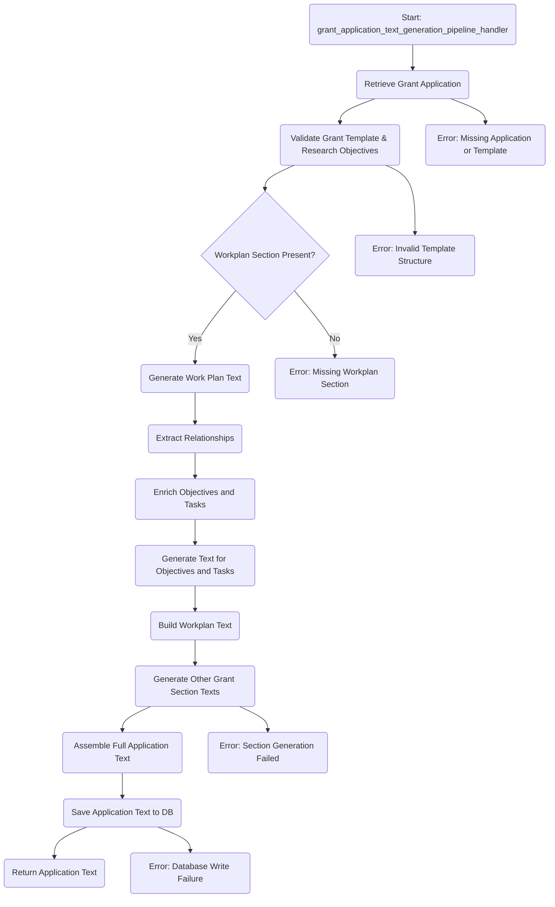

# Grant Application Text Generation Flow

This flowchart describes the pipeline for generating grant application texts.
It includes stages for retrieving, validating, generating, and assembling the full application text, along with error handling at each critical point.

