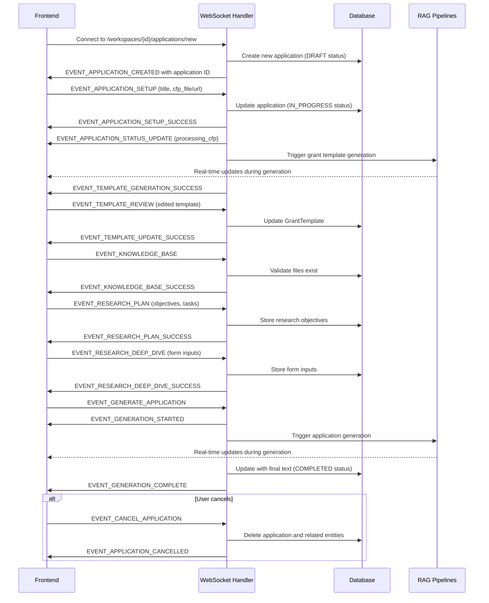
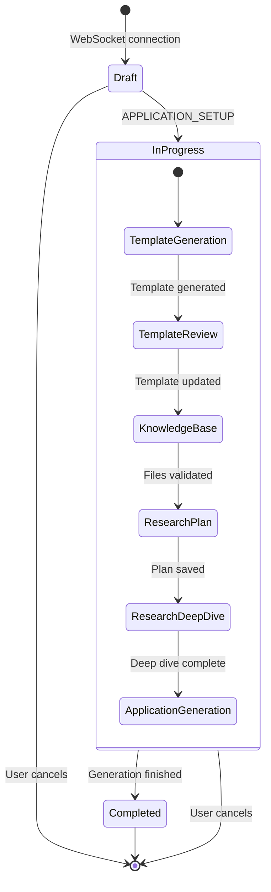
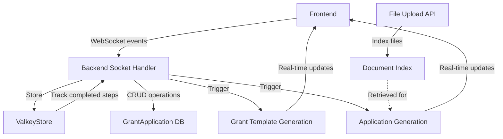

# Grant Application Wizard Architecture

This diagram shows the interaction between the frontend and backend components of the Grant Application Wizard.

## WebSocket Communication Flow

## Wizard State Management

## Data Flow

