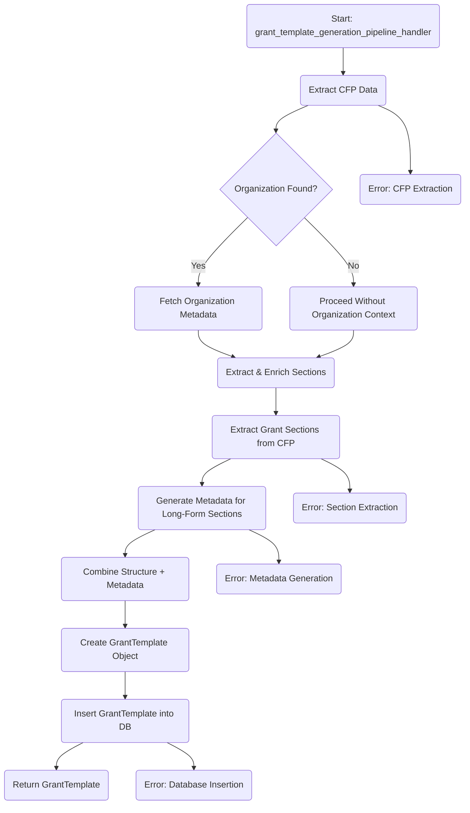

# Grant Template Generation Flow

This flowchart represents the process of generating a grant template based on extracted CFP data.
It covers extracting, validating, enriching sections, creating the final template, and handling possible errors at each step.

