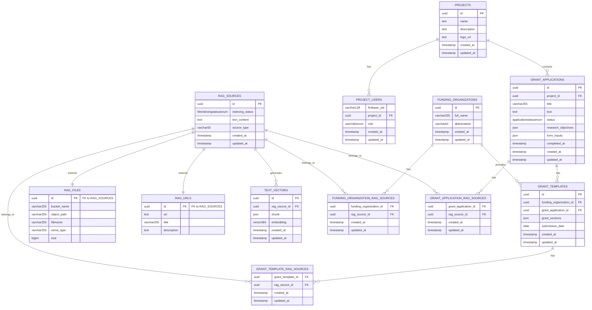

# Data-Model

The following diagram shows the data model of the application. It includes the main entities and their relationships.

```mermaid
erDiagram
    FUNDING_ORGANIZATIONS {
        uuid id PK
        varchar255 full_name
        varchar64 abbreviation
        timestamp created_at
        timestamp updated_at
    }

    PROJECTS {
        uuid id PK
        text name
        text description
        text logo_url
        timestamp created_at
        timestamp updated_at
    }

    PROJECT_USERS {
        varchar128 firebase_uid
        uuid project_id FK
        userroleenum role
        timestamp created_at
        timestamp updated_at
    }

    GRANT_APPLICATIONS {
        uuid id PK
        uuid project_id FK
        varchar255 title
        text text
        applicationstatusenum status
        json research_objectives
        json form_inputs
        timestamp completed_at
        timestamp created_at
        timestamp updated_at
    }

    GRANT_TEMPLATES {
        uuid id PK
        uuid funding_organization_id FK
        uuid grant_application_id FK
        json grant_sections
        date submission_date
        timestamp created_at
        timestamp updated_at
    }

    RAG_SOURCES {
        uuid id PK
        fileindexingstatusenum indexing_status
        text text_content
        varchar50 source_type
        timestamp created_at
        timestamp updated_at
    }

    RAG_FILES {
        uuid id PK "FK to RAG_SOURCES"
        varchar255 bucket_name
        varchar255 object_path
        varchar255 filename
        varchar255 mime_type
        bigint size
    }

    RAG_URLS {
        uuid id PK "FK to RAG_SOURCES"
        text url
        varchar255 title
        text description
    }

    TEXT_VECTORS {
        uuid id PK
        uuid rag_source_id FK
        json chunk
        vector384 embedding
        timestamp created_at
        timestamp updated_at
    }

    FUNDING_ORGANIZATION_RAG_SOURCES {
        uuid funding_organization_id FK
        uuid rag_source_id FK
        timestamp created_at
        timestamp updated_at
    }

    GRANT_APPLICATION_RAG_SOURCES {
        uuid grant_application_id FK
        uuid rag_source_id FK
        timestamp created_at
        timestamp updated_at
    }

    GRANT_TEMPLATE_RAG_SOURCES {
        uuid grant_template_id FK
        uuid rag_source_id FK
        timestamp created_at
        timestamp updated_at
    }

    PROJECTS ||--o{ PROJECT_USERS : has
    PROJECTS ||--o{ GRANT_APPLICATIONS : contains
    GRANT_APPLICATIONS ||--o{ GRANT_TEMPLATES : has
    FUNDING_ORGANIZATIONS ||--o{ GRANT_TEMPLATES : provides

    RAG_SOURCES ||--o{ TEXT_VECTORS : generates
    RAG_SOURCES ||--|| RAG_FILES : extends
    RAG_SOURCES ||--|| RAG_URLS : extends

    FUNDING_ORGANIZATIONS ||--o{ FUNDING_ORGANIZATION_RAG_SOURCES : has
    RAG_SOURCES ||--o{ FUNDING_ORGANIZATION_RAG_SOURCES : belongs_to

    GRANT_APPLICATIONS ||--o{ GRANT_APPLICATION_RAG_SOURCES : has
    RAG_SOURCES ||--o{ GRANT_APPLICATION_RAG_SOURCES : belongs_to

    GRANT_TEMPLATES ||--o{ GRANT_TEMPLATE_RAG_SOURCES : has
    RAG_SOURCES ||--o{ GRANT_TEMPLATE_RAG_SOURCES : belongs_to
```