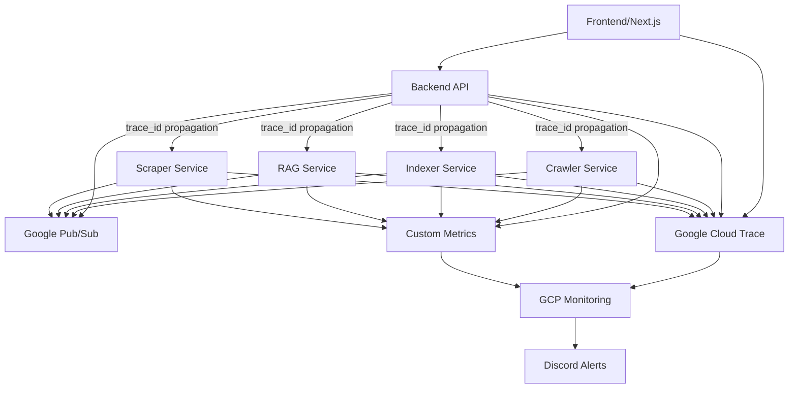

# OpenTelemetry Design & Architecture

**Version:** 1.0
**Last Updated:** January 2025
**Status:** Production Ready

## Executive Summary

This document describes the comprehensive OpenTelemetry (OTEL) implementation for GrantFlow.AI, providing distributed tracing, custom metrics, and structured logging across all services. The implementation enables full observability for debugging, monitoring, and performance optimization.

## Architecture Overview



## Core Components

### 1. Shared Utilities (`packages/shared_utils/src/`)

#### OpenTelemetry Configuration (`otel.py`)
- **Purpose**: Centralized OTEL setup for all services
- **Features**:
  - Automatic Cloud Trace integration in production
  - Resource attributes (service name, environment, GCP project)
  - HTTP and SQLAlchemy auto-instrumentation
  - Environment-based configuration

```python
from packages.shared_utils.src.otel import configure_otel

# In each service's main.py
configure_otel("service-name")
```

#### Distributed Tracing (`tracing.py`)
- **Purpose**: Span utilities and trace ID correlation
- **Key Features**:
  - `start_span_with_trace_id()` - Creates spans with trace correlation
  - `add_span_attributes()` - Adds contextual metadata to spans
  - `record_exception()` - Structured exception recording
  - Automatic context variable binding

#### Custom Metrics (`metrics.py`)
- **Purpose**: Business and infrastructure metrics
- **Metrics Provided**:
  - `http_requests_total` - API endpoint usage
  - `database_operations_total` - Database interaction tracking
  - `pubsub_messages_total` - Message queue metrics
  - `document_processing_total` - Content processing metrics
  - `ai_completion_total` - LLM API usage
  - `http_request_duration` - Response time tracking

#### Enhanced Logging (`logger.py`)
- **Purpose**: Structured logging with OTEL context
- **Features**:
  - Automatic trace_id and span_id injection
  - Structured key=value format (not f-strings)
  - Context preservation across async operations

### 2. Service Integration

All services (`backend`, `crawler`, `indexer`, `rag`, `scraper`) follow the same pattern:

```python
# In each service's main.py
from packages.shared_utils.src.otel import configure_otel
from packages.shared_utils.src.tracing import start_span_with_trace_id
from packages.shared_utils.src.metrics import http_requests_total

# 1. Configure OTEL on startup
configure_otel("service-name")

# 2. Use tracing in operations
with start_span_with_trace_id("operation_name", trace_id=trace_id) as span:
    span.set_attribute("key", "value")
    # operation logic

# 3. Record metrics
http_requests_total.add(1, attributes={"service": "backend", "endpoint": "/api/endpoint"})
```

### 3. Frontend Integration (`frontend/src/utils/tracing.ts`)

- **Purpose**: Generate and propagate trace IDs to backend
- **Features**:
  - UUID-based trace ID generation
  - `X-Trace-ID` header injection
  - API client integration

## Key Design Decisions

### 1. Trace ID Correlation
- **Strategic Rename**: `correlation_id` → `trace_id` for OTEL standard alignment
- **Frontend-to-Backend**: Trace IDs originate in frontend, flow through all services
- **Pub/Sub Propagation**: Trace context propagated through message attributes

### 2. Naming Convention
- **Consistent Format**: All metrics use snake_case with descriptive suffixes
- **Service Prefixing**: Span names include service context (e.g., `backend.api.request`)
- **Hierarchical Structure**: Parent-child span relationships for request flows

### 3. Environment Configuration
```bash
# Required for all services
GOOGLE_CLOUD_PROJECT=grantflow

# Optional: Enable Cloud Trace in development
ENABLE_CLOUD_TRACE=1

# Optional: Discord webhook for monitoring alerts
DISCORD_WEBHOOK_URL=https://discord.com/api/webhooks/...
```

### 4. Performance Considerations
- **Sampling**: Uses OTEL default sampling (head-based)
- **Async Safe**: All utilities work with async/await patterns
- **Low Overhead**: Minimal performance impact on request processing
- **Batched Export**: Spans exported in batches to reduce network calls

## Monitoring & Alerting

### Alert Policies (Terraform-managed)
- **Service Health**: Zero 2xx responses for 5+ minutes
- **Database Connectivity**: No connections for 3+ minutes
- **Scraper Activity**: No activity for 48+ hours
- **Pub/Sub Health**: High undelivered messages for 20+ minutes
- **Error Rate**: >50% errors for 10+ minutes

### Discord Integration
- Alerts sent to Discord via webhook
- Configurable per environment
- Rich formatting with service context

## Testing Strategy

### Unit Tests
- **Configuration Tests**: `packages/shared_utils/tests/otel_test.py`
- **Tracing Tests**: `packages/shared_utils/tests/tracing_test.py`
- **Metrics Tests**: `packages/shared_utils/tests/metrics_test.py`
- **Logger Tests**: `packages/shared_utils/tests/logger_otel_test.py`

### Integration Testing
- **Manual Script**: `scripts/test_otel_integration.py`
- **E2E Validation**: Trace propagation across services
- **Performance Testing**: Overhead measurement

### CI/CD Integration
- Tests run in parallel with xdist
- Environment variable validation
- Cloud Trace connectivity verification

## Deployment Architecture

### Cloud Infrastructure
- **Google Cloud Trace**: Primary tracing backend (production)
- **Console Output**: Development/local tracing
- **Cloud Monitoring**: Metrics aggregation and alerting
- **Discord Webhooks**: Alert notifications

### Environment Strategy
- **Development**: Local OTEL with optional Cloud Trace
- **Staging**: Full Cloud Trace integration
- **Production**: Full observability with alerting

## Usage Examples

### Basic Request Tracing
```python
from packages.shared_utils.src.tracing import start_span_with_trace_id

async def process_request(trace_id: str) -> dict:
    with start_span_with_trace_id("process_request", trace_id=trace_id) as span:
        span.set_attribute("user_id", user_id)
        span.set_attribute("operation_type", "api_request")

        # Your business logic here
        result = await some_operation()

        return result
```

### Custom Metrics Recording
```python
from packages.shared_utils.src.metrics import document_processing_total

# Record successful document processing
document_processing_total.add(1, attributes={
    "service": "indexer",
    "document_type": "pdf",
    "status": "success"
})
```

### Error Handling with Tracing
```python
from packages.shared_utils.src.tracing import record_exception

try:
    result = await risky_operation()
except Exception as e:
    record_exception(e, escaped=True)
    logger.error("Operation failed", error=str(e), trace_id=trace_id)
    raise
```

## Maintenance & Evolution

### Regular Tasks
- **Performance Review**: Monthly overhead analysis
- **Alert Tuning**: Quarterly threshold adjustment
- **Documentation Updates**: As needed for new features

### Scaling Considerations
- **Sampling Adjustment**: Increase sampling as traffic grows
- **Cost Monitoring**: Track Cloud Trace usage costs
- **Storage Retention**: Configure appropriate trace retention periods

### Future Enhancements
- **Custom Samplers**: Implement intelligent sampling strategies
- **Metrics Dashboard**: Grafana integration for custom metrics
- **Log Correlation**: Enhanced log-trace correlation features

## Security Considerations

- **PII Handling**: Never include sensitive data in span attributes
- **Token Security**: Secure Discord webhook URLs
- **Access Control**: Restrict Cloud Trace access to authorized personnel
- **Data Retention**: Configure appropriate retention policies

## Support & Troubleshooting

### Common Issues
1. **Missing Traces**: Check `GOOGLE_CLOUD_PROJECT` environment variable
2. **High Overhead**: Review span creation frequency
3. **Alert Noise**: Tune alert thresholds in Terraform

### Debug Commands
```bash
# Test OTEL integration
python scripts/test_otel_integration.py

# Check Cloud Trace connectivity
gcloud logging read "resource.type=cloud_run_revision" --limit=10

# Validate metrics export
curl -H "Authorization: Bearer $(gcloud auth print-access-token)" \
  "https://monitoring.googleapis.com/v3/projects/PROJECT_ID/metricDescriptors"
```

This architecture provides comprehensive observability while maintaining performance and simplifying operations across the entire GrantFlow.AI platform.