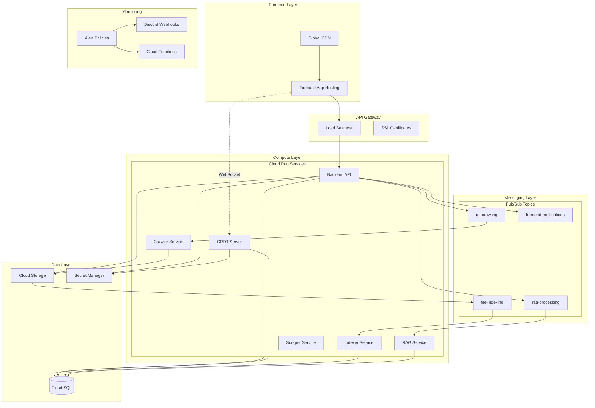

# GrantFlow Cloud Architecture

## Overview

GrantFlow is a cloud-native application built on Google Cloud Platform (GCP) using Infrastructure as Code (IaC) principles with OpenTofu (Terraform). The architecture follows a microservices pattern with event-driven communication and serverless compute.

## Architecture Principles

### 1. Serverless-First Approach
- **Cloud Run** for containerized services with automatic scaling
- **Cloud Functions** for event-driven operations
- **Firebase App Hosting** for frontend deployment
- Scale-to-zero capability for cost optimization

### 2. Event-Driven Architecture
- **Pub/Sub** for asynchronous message passing
- Fanout pattern for parallel processing
- Dead letter queues for error handling
- Push subscriptions to Cloud Run services

### 3. Security by Design
- Service accounts with least privilege access
- Secret Manager for sensitive configuration
- KMS encryption for storage buckets
- Workload Identity Federation for CI/CD

## Core Services Architecture

### Backend Services (Cloud Run)

All services follow a consistent deployment pattern:
- Container-based deployment with automatic scaling
- Service-specific memory and CPU limits
- Environment-specific concurrency settings:
  - **Staging**: Fanout pattern with `concurrency=1` for indexer/crawler (429 mitigation)
  - **Production**: Optimized with `concurrency=50` for indexer (throughput optimization)
- Scale-to-zero with configurable min/max instances

```
┌──────────────────────────────────────────────────────────────────┐
│                        Cloud Run Services                        │
├───────────────┬────────────┬────────────┬──────────┬───────────┤
│   Backend API │   Crawler  │   Indexer  │   RAG    │   CRDT    │
│   (REST/WS)   │   (Web)    │   (Docs)   │  (AI)    │   (WS)    │
└───────────────┴────────────┴────────────┴──────────┴───────────┘
```

### Message Flow Architecture

```
User Upload → GCS Bucket → Pub/Sub Notification → Indexer Service
     ↓                                                    ↓
Web Crawl → Crawler Service → Pub/Sub → RAG Processing Service
                                              ↓
                                    Frontend Notifications
```

## Infrastructure Modules

### 1. Networking (`/network`)
- VPC with custom subnets
- Private service connectivity for Cloud SQL
- Global load balancer for backend API
- SSL certificates and security policies

### 2. Database (`/database`)
- Cloud SQL PostgreSQL with pgvector extension
- Private IP connectivity
- Automated backups and high availability
- Connection pooling via Cloud Run

### 3. Storage (`/storage`)
- GCS buckets with KMS encryption
- Lifecycle policies for cost optimization
- Pub/Sub notifications for file uploads
- Separate buckets for uploads and scraper data

### 4. Pub/Sub (`/pubsub`)
- Topics for service communication:
  - `file-indexing`: Document processing pipeline
  - `url-crawling`: Web content extraction
  - `rag-processing`: AI/ML processing
  - `frontend-notifications`: WebSocket updates
  - `email-notifications`: Transactional email delivery
- Dead letter queues for error handling
- Push subscriptions with retry policies

### 5. IAM (`/iam`)
- Service accounts per service
- Workload Identity for GitHub Actions
- Role bindings following least privilege
- Separate accounts for CI/CD and runtime

### 6. Secrets (`/secrets`)
- Secret Manager for API keys and credentials
- KMS encryption for secret storage
- Service-specific access controls
- Automatic rotation support

### 7. Monitoring (`/monitoring`)
- Alert policies for service health
- Discord webhook integration
- Budget alerts and cost monitoring
- Cloud Functions for alert processing
- Metrics for:
  - Service uptime
  - Error rates
  - Database connectivity
  - Pub/Sub message processing

### 8. Cloud Functions (`/email_notifications`, `/monitoring`)
- Email notification handler
- Budget alert processor
- App hosting alert handler
- Entity cleanup scheduler

## Deployment Architecture

### Frontend (Firebase App Hosting)
- Automatic builds from Git branches
- Environment-specific configurations
- CDN distribution
- SSL certificates

### Backend Services (Cloud Run)
- Docker containerization
- Artifact Registry for image storage
- Blue-green deployments
- Health checks and readiness probes

### CRDT Server (Cloud Run with WebSockets)
- **Purpose**: Real-time collaborative editing backend
- **Technology**: Hocuspocus (Y.js WebSocket server)
- **Features**:
  - WebSocket connections with session affinity
  - Document persistence to PostgreSQL
  - Automatic conflict resolution via CRDTs
  - Health check endpoint for monitoring
- **URLs**:
  - Production: `wss://crdt.grantflow.ai`
  - Staging: `wss://staging-crdt.grantflow.ai`
- **Configuration**:
  - Port: 8080 (standard Cloud Run)
  - Session affinity enabled for stable connections
  - Auto-scaling based on connection count

## Event-Driven Patterns

### Fanout Pattern Implementation
Each Cloud Run service processes one message at a time:
```hcl
# Example: Indexer Service
concurrency_limit = 1     # One message per instance
min_instances     = 0     # Scale to zero
max_instances     = 100   # High ceiling for bursts
```

This pattern ensures:
- Predictable resource usage per message
- No memory exhaustion from concurrent processing
- Automatic scaling based on queue depth
- Cost optimization through scale-to-zero

### Pub/Sub Push Subscriptions
```
Topic → Subscription → Cloud Run Service
              ↓
        Dead Letter Queue (on failure)
```

## Security Architecture

### Authentication & Authorization
- Firebase Authentication for users
- JWT tokens with organization context
- Service-to-service authentication via service accounts
- API Gateway with security policies

### Data Protection
- KMS encryption at rest
- TLS for data in transit
- Secret Manager for sensitive configuration
- VPC Service Controls for network isolation

## High Availability & Disaster Recovery

### Multi-Zone Deployment
- Cloud Run services across zones
- Cloud SQL with automated backups
- GCS with multi-region replication
- Load balancer with health checks

### Error Handling
- Dead letter queues for message processing
- Exponential backoff retry policies
- Circuit breakers in application code
- Comprehensive logging and tracing

## Cost Optimization

### Scale-to-Zero Services
- Cloud Run min instances = 0
- Cloud Functions for infrequent tasks
- Scheduled scaling for predictable loads

### Resource Limits
- Service-specific CPU/memory allocation
- Concurrency limits to prevent overload:
  - Staging uses fanout pattern (concurrency=1) for rate limit mitigation
  - Production uses optimized concurrency for throughput
- Storage lifecycle policies
- Budget alerts and monitoring

### Important Conventions
- Comments marked with `~keep` indicate critical constraints that must be preserved
- Example: `# ~keep ONE message per instance for fanout pattern`

## Infrastructure Diagram



## Terraform Module Structure

```
terraform/
├── environments/
│   ├── staging/          # Staging environment configuration
│   └── production/       # Production environment configuration
├── modules/
│   ├── app_hosting/      # Firebase App Hosting
│   ├── cloud_run/        # Cloud Run services
│   ├── database/         # Cloud SQL
│   ├── email_notifications/ # Email function
│   ├── iam/              # Identity and access
│   ├── load_balancer/    # Global load balancing
│   ├── monitoring/       # Alerts and monitoring
│   ├── network/          # VPC and networking
│   ├── pubsub/          # Pub/Sub topics
│   ├── scheduler/        # Cloud Scheduler
│   ├── secrets/          # Secret Manager
│   └── storage/          # Cloud Storage
└── backend.tf            # Terraform state configuration
```

## Key Design Decisions

### 1. Fanout Pattern for Processing
- Each service instance handles one message
- Prevents memory exhaustion
- Enables predictable scaling
- Simplifies error handling

### 2. Push vs Pull Subscriptions
- Push subscriptions to Cloud Run
- Automatic scaling based on message volume
- No polling overhead
- Built-in retry mechanisms

### 3. Service Mesh vs Direct Communication
- Direct service-to-service via Pub/Sub
- Reduces complexity
- Leverages GCP-native features
- Async by default

### 4. Containerization Strategy
- All services containerized
- Multi-stage Docker builds
- Minimal base images
- Security scanning in CI/CD

## Operational Considerations

### Monitoring & Alerting
- Service-level SLOs
- Error budget tracking
- Proactive alerting via Discord
- Distributed tracing with OpenTelemetry

### Deployment Strategy
- GitOps with GitHub Actions
- Environment promotion (staging → production)
- Automated rollbacks on failure
- Feature flags for gradual rollouts

### Capacity Planning
- Auto-scaling based on metrics
- Predictive scaling for known patterns
- Budget controls and alerts
- Regular performance reviews

## Future Considerations

### Potential Enhancements
- Multi-region deployment for global availability
- GraphQL federation for API gateway
- Service mesh for advanced traffic management
- Chaos engineering for resilience testing

### Scalability Path
- Database read replicas for scale
- Caching layer with Redis/Memorystore
- CDN expansion for static assets
- Horizontal sharding for data growth
