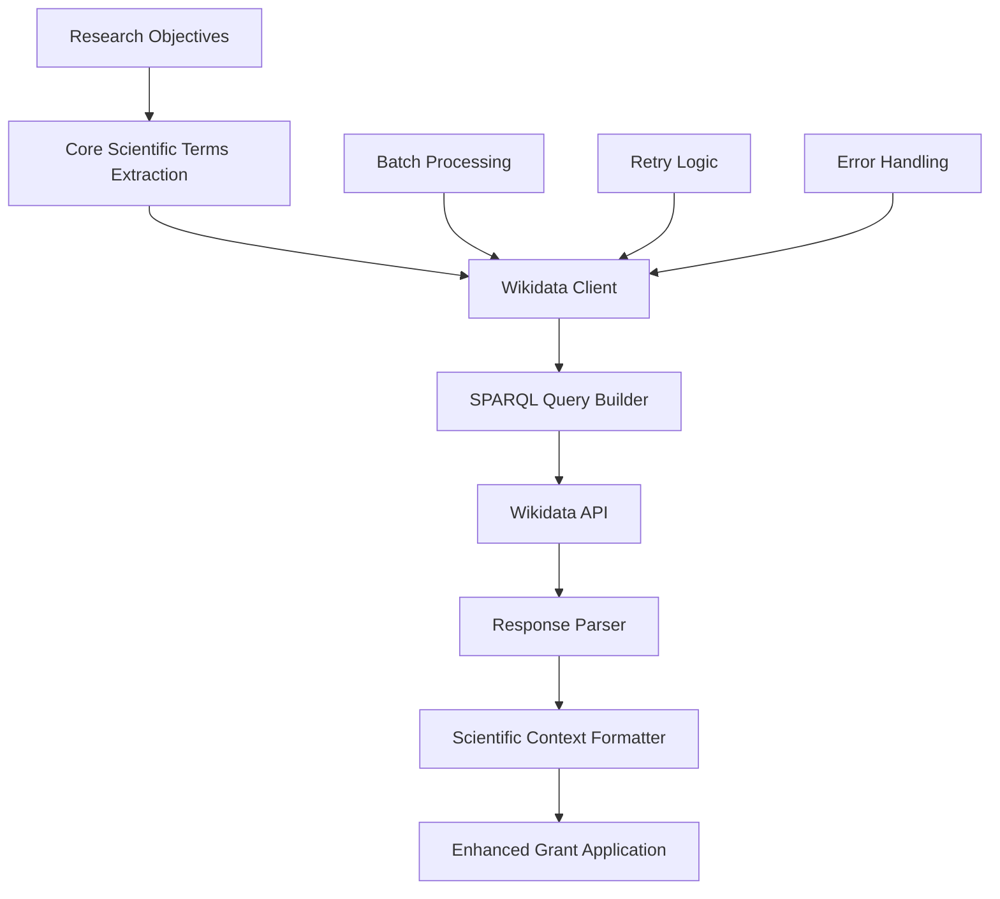

# Wikidata-Enhanced Scientific Context

## Overview

The Wikidata enhancement feature enriches grant application generation by providing scientific context from Wikidata's knowledge base. This enhancement improves the quality and scientific accuracy of generated grant applications by incorporating foundational scientific concepts and terminology.

## Architecture



## Implementation Details

### 1. Core Scientific Terms Extraction

The system extracts 5 core scientific terms from each research objective and task during the enrichment phase. These terms represent the foundational scientific concepts underlying the research.

**Location**: `services/rag/src/grant_application/enrich_research_objective.py`

### 2. Wikidata Client

An async client that handles communication with Wikidata's SPARQL endpoint.

**Features**:
- Batch processing of scientific terms
- Exponential backoff retry logic
- Structured logging and tracing
- Error handling with graceful degradation

**Location**: `services/rag/src/utils/wikidata_client.py`

### 3. SPARQL Query Builder

Constructs optimized SPARQL queries to retrieve scientific context for given terms.

**Query Structure**:
```sparql
PREFIX wd: <http://www.wikidata.org/entity/>
PREFIX wdt: <http://www.wikidata.org/prop/direct/>
PREFIX rdfs: <http://www.w3.org/2000/01/rdf-schema#>

SELECT ?term ?description ?aliases
WHERE {
  ?item rdfs:label ?term .
  ?item wdt:P31 ?type .
  ?item rdfs:comment ?description .
  OPTIONAL { ?item skos:altLabel ?aliases }
  FILTER(?term IN ("term1", "term2", "term3"))
  FILTER(LANG(?term) = "en")
  FILTER(LANG(?description) = "en")
}
```

### 4. Scientific Context Formatter

Formats Wikidata responses into structured scientific context for LLM consumption.

**Template**:
```
## Scientific Foundation Context
{formatted_scientific_context}

This context provides foundational scientific concepts and terminology relevant to the research objective. Use these terms and concepts to enhance the depth and accuracy of your response.
```

**Location**: `services/rag/src/utils/scientific_context.py`

## Pipeline Integration

The Wikidata enhancement is integrated into the grant application generation pipeline at stage 6:

1. **Stage 5**: Objectives enrichment (extracts core scientific terms)
2. **Stage 6**: Wikidata enhancement (retrieves scientific context)
3. **Stage 7+**: Text generation (incorporates scientific context)

**Location**: `services/rag/src/grant_application/handler.py`

## Configuration

### Environment Variables

```bash
# Wikidata Configuration
WIKIDATA_BASE_URL=https://query.wikidata.org/sparql
WIKIDATA_BATCH_SIZE=5
WIKIDATA_TIMEOUT=30
WIKIDATA_MAX_RETRIES=3
```

### Default Values

- **Base URL**: Wikidata's public SPARQL endpoint
- **Batch Size**: 5 terms per query (optimized for performance)
- **Timeout**: 30 seconds per request
- **Max Retries**: 3 attempts with exponential backoff

## Error Handling

The system implements graceful degradation:

1. **Network Errors**: Logged but don't fail the pipeline
2. **API Errors**: Retried with exponential backoff
3. **Parse Errors**: Return empty context, continue pipeline
4. **Timeout Errors**: Logged, return partial results

## Performance Considerations

- **Batch Processing**: Terms are processed in batches to optimize API calls
- **Caching**: Responses are not cached to ensure fresh scientific context
- **Parallel Processing**: Multiple terms can be processed concurrently
- **Rate Limiting**: Respects Wikidata's rate limits with built-in delays

## Testing

Unit tests cover:

- **Client Functionality**: Context manager, request handling, error scenarios
- **Query Building**: SPARQL query construction and validation
- **Response Parsing**: Various response formats and edge cases
- **Batch Processing**: Multiple term handling and optimization
- **Retry Logic**: Failure scenarios and recovery

**Location**: `services/rag/tests/utils/wikidata_client_test.py`

## Monitoring

The feature includes comprehensive monitoring:

- **Notification Events**: `ENHANCING_WITH_WIKIDATA`, `WIKIDATA_ENHANCEMENT_COMPLETE`
- **Structured Logging**: Request/response logging with trace IDs
- **Metrics**: Success rates, response times, error counts
- **Tracing**: OpenTelemetry integration for distributed tracing

## Future Enhancements

1. **Caching Layer**: Redis-based caching for frequently requested terms
2. **Semantic Search**: Enhanced term matching using embeddings
3. **Domain-Specific Queries**: Specialized queries for different research domains
4. **Offline Mode**: Local knowledge base for offline operation
5. **Custom Endpoints**: Support for private Wikidata instances

## Example Usage

```python
from services.rag.src.utils.wikidata_client import WikidataClient

async def get_scientific_context(terms: list[str], trace_id: str) -> str:
    async with WikidataClient() as client:
        return await client.get_scientific_context(terms, trace_id)

# Usage
context = await get_scientific_context(
    ["machine learning", "artificial intelligence"], 
    "trace-123"
)
```

## Dependencies

- **aiohttp**: Async HTTP client for API communication
- **packages.shared_utils**: Logging, tracing, and environment utilities
- **pytest**: Testing framework for unit tests
- **unittest.mock**: Mocking utilities for testing 