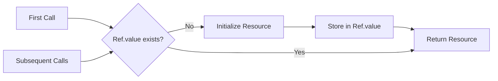
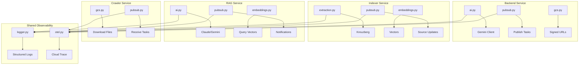

# GrantFlow.AI Shared Utilities Package

Shared utilities for AI/LLM operations, Pub/Sub messaging, Cloud Storage, embeddings, logging, serialization, and observability across GrantFlow.AI microservices.

## Package Structure

```
/src
  # AI & LLM
  ai.py                 # Gemini & Claude clients, token counting, model configuration

  # Messaging & Communication
  pubsub.py            # Pub/Sub publishing/subscribing with OpenTelemetry trace context
  discord.py           # Discord webhook notifications (scraper reports)

  # Storage & Data Operations
  gcs.py               # Cloud Storage operations (upload, download, signed URLs)
  serialization.py     # msgspec-based JSON serialization with custom encode hooks
  embeddings.py        # SentenceTransformer embeddings for RAG vector search
  extraction.py        # Kreuzberg text extraction with entity/keyword/document classification

  # Observability & Logging
  logger.py            # Structured logging with structlog (key=value format)
  otel.py              # OpenTelemetry configuration (Cloud Trace, metrics)
  tracing.py           # Distributed tracing utilities

  # Utilities
  retry.py             # Tenacity-based retry decorators (with/without exponential backoff)
  sync.py              # Async/sync interop (run_sync, as_async_callable, batched_gather)
  text.py              # Text processing utilities
  nlp.py               # NLP operations (spaCy models, word counting, BM25)
  html.py              # HTML parsing and cleaning
  url_utils.py         # URL validation and parsing

  # Configuration & Infrastructure
  env.py               # Environment variable handling
  ref.py               # Lazy initialization pattern (Ref[T])
  patterns.py          # Common design patterns
  server.py            # Litestar server configuration
  constants.py         # Shared constants
  dto.py               # Data transfer objects
  shared_types.py      # Common type definitions
  stopwords.py         # Academic/scientific stopwords
  exceptions.py        # Exception hierarchy
```

## Module Categories

### AI/LLM (`ai.py`)

Client initialization and model configuration for AI operations.

```python
from packages.shared_utils.src.ai import (
    get_google_ai_client,      # Gemini client (Flash 2.5)
    get_anthropic_client,      # Claude client (Sonnet 4)
    count_tokens,              # Token counting for any model
    estimate_token_count,      # Fast estimation (cached)
    GENERATION_MODEL,          # Default: gemini-flash-latest
    REASONING_MODEL,           # Default: gemini-flash-latest
    ANTHROPIC_SONNET_MODEL,    # Default: claude-sonnet-4-20250514
)

# Lazy initialization via Ref pattern
client = get_google_ai_client()  # Initializes once, reuses thereafter
tokens = await count_tokens(text, model="gemini-flash-latest")
```

**Key Features:**
- Lazy initialization of clients (Ref pattern)
- Configurable via environment variables (GOOGLE_AI_API_KEY, ANTHROPIC_API_KEY)
- Token estimation with LRU cache (1000 entries)
- Fallback to character/word-based estimation

### Messaging (`pubsub.py`)

Pub/Sub operations with OpenTelemetry distributed tracing.

```python
from packages.shared_utils.src.pubsub import (
    publish_url_crawling_task,      # Trigger crawler service
    publish_rag_task,                # Trigger RAG processing
    publish_autofill_task,           # Trigger research plan/deep dive autofill
    publish_notification,            # Send frontend notifications
    publish_email_notification,      # Trigger email service
    pull_notifications,              # Pull frontend notifications
    inject_trace_context,            # Add OpenTelemetry context to messages
    extract_trace_context,           # Extract context for span linking
)

# Example: Publish URL crawling task
message_id = await publish_url_crawling_task(
    url="https://example.com",
    source_id=source_id,
    entity_type="grant_application",
    entity_id=application_id,
    trace_id=trace_id,
)
```

**Topics:**
- `url-crawling`: Crawler service tasks
- `file-indexing`: Indexer service tasks
- `rag-processing`: RAG service tasks
- `frontend-notifications`: WebSocket notifications
- `email-notifications`: Email service tasks

**Key Features:**
- Automatic trace context injection/extraction
- Duplicate handling via `ON CONFLICT DO NOTHING` in consumers
- Message size validation
- Structured logging with duration tracking

### Storage (`gcs.py`)

Cloud Storage operations with signed URLs and dev/emulator support.

```python
from packages.shared_utils.src.gcs import (
    download_blob,                   # Download file from GCS
    upload_blob,                     # Upload file to GCS
    delete_blob,                     # Delete file from GCS
    create_signed_upload_url,        # Generate PUT signed URL
    create_signed_download_url,      # Generate GET signed URL
    construct_object_uri,            # Build object path
    parse_object_uri,                # Parse object path
)

# Example: Create signed upload URL
url = await create_signed_upload_url(
    entity_type="grant_application",
    entity_id=application_id,
    source_id=source_id,
    blob_name="document.pdf",
    content_type="application/pdf",
)
```

**URI Format:** `{entity_type}/{entity_id}/{source_id}/{blob_name}`

**Key Features:**
- Dev bypass mode (DEBUG=true): Returns `dev://` URLs
- Emulator support (STORAGE_EMULATOR_HOST): Returns emulator URLs
- Signed URL generation (5-minute expiration for uploads, 60-minute for downloads)
- Automatic bucket creation

### Data (`serialization.py`)

High-performance msgspec-based serialization with custom type handling.

```python
from packages.shared_utils.src.serialization import (
    serialize,              # Encode to bytes
    deserialize,            # Decode from bytes/str
    to_builtins,            # Convert to Python builtins
    encode_hook,            # Custom type encoder
)

# Example: Serialize TypedDict
from uuid import UUID
data = {"id": UUID("..."), "status": SomeEnum.VALUE}
encoded = serialize(data)  # Handles UUID, Enum, dataclasses, etc.

# Deserialize with type validation
result = deserialize(encoded, MyTypedDict)
```

**Custom Type Support:**
- Enums → `.value`
- Exceptions → `{message, type, code, details}`
- dataclasses → `asdict()`
- Objects with `to_dict()`, `model_dump()`, etc.

### Embeddings (`embeddings.py`)

SentenceTransformer-based vector embeddings for RAG.

```python
from packages.shared_utils.src.embeddings import (
    generate_embeddings,    # Generate embeddings for text(s)
    index_chunks,           # Batch process chunks with embeddings
    get_embedding_model,    # Get model instance (cached)
    EMBEDDING_MODEL_NAME,   # Default: all-MiniLM-L12-v2
)

# Example: Generate embeddings
embeddings = await generate_embeddings(
    ["First text", "Second text"],
    model_name=EMBEDDING_MODEL_NAME,
)

# Batch index chunks (30 chunks per batch)
vectors = await index_chunks(
    chunks=chunks,
    source_id=source_id,
    model_name=EMBEDDING_MODEL_NAME,
)
```

**Key Features:**
- Model caching (cache-first, download fallback)
- Batch processing (30 chunks per batch)
- Lock-protected model loading
- Duration tracking

### Text Extraction (`extraction.py`)

Kreuzberg-based text extraction with entity/keyword extraction and document classification.

```python
from packages.shared_utils.src.extraction import (
    extract_file_content,              # Extract text, chunks, metadata
    get_scientific_extraction_config,  # Config for academic documents
    enrich_metadata_with_entities_keywords,  # Add NER/keyword extraction
    classify_document_content,         # Detect document type
)

# Example: Extract with full pipeline
content, mime_type, chunks, metadata = await extract_file_content(
    content=file_bytes,
    mime_type="application/pdf",
    enable_chunking=True,
    enable_token_reduction=True,
    enable_entity_extraction=True,
    enable_keyword_extraction=True,
    enable_document_classification=True,
    language_hint="en",
)
```

**Metadata Fields:**
- `entities`: List of `{type, text}` from spaCy NER + Kreuzberg
- `keywords`: List of `{keyword, score}` (min_score=0.35)
- `document_type`: "research" | other
- `categories`: ["research", "scientific", "academic"]

**Key Features:**
- Dual entity extraction (Kreuzberg + spaCy for coverage)
- Scientific stopwords filtering
- Token reduction with moderate mode
- Tesseract OCR with markdown output

### Observability (`logger.py`, `otel.py`, `tracing.py`)

Structured logging and distributed tracing.

```python
# Structured logging
from packages.shared_utils.src.logger import get_logger

logger = get_logger(__name__)
logger.info("Processing grant", grant_id=str(grant_id), status="pending")
# Output: {"event": "Processing grant", "grant_id": "...", "status": "pending", "timestamp": "..."}

# OpenTelemetry configuration
from packages.shared_utils.src.otel import configure_otel, get_tracer

configure_otel("backend")
tracer = get_tracer("backend.grants")

with tracer.start_as_current_span("process_grant") as span:
    span.set_attribute("grant_id", str(grant_id))
    # ... processing
```

**Logging Features:**
- Structured key=value format (never f-strings)
- UUID/datetime conversion (str, isoformat)
- Automatic trace_id/span_id injection
- Truncation for long values (500 chars, 5 list items, 10 dict keys)
- JSON output for Cloud Run, Console for local dev

**OpenTelemetry:**
- Cloud Trace export (disabled in local dev)
- SQLAlchemy instrumentation
- HTTPX instrumentation
- Resource attributes (service.name, environment, version)

### Utilities (`retry.py`, `sync.py`)

Retry logic and async/sync interop.

```python
# Retry with exponential backoff
from packages.shared_utils.src.retry import (
    with_retry,                        # Simple retry
    with_exponential_backoff_retry,    # Exponential backoff + jitter
)

from packages.shared_utils.src.exceptions import ExternalOperationError

@with_exponential_backoff_retry(
    ExternalOperationError,
    max_retries=5,
    initial_wait=5,
    max_wait=60,
    jitter=5,
)
async def fetch_data():
    # Retries on ExternalOperationError
    ...

# Async/sync interop
from packages.shared_utils.src.sync import (
    run_sync,           # Run sync function in thread pool
    as_async_callable,  # Wrap sync function as async
    batched_gather,     # Gather coroutines in batches
)

# Run blocking operation in thread pool
result = await run_sync(blocking_function, arg1, arg2)

# Batch concurrent operations
results = await batched_gather(*coroutines, batch_size=10)
```

## Key Patterns

### Ref Lazy Initialization Pattern



The `Ref[T]` pattern enables lazy initialization of expensive resources (AI clients, storage clients, embedding models):

```python
from packages.shared_utils.src.ref import Ref

client_ref = Ref[SomeClient]()

def get_client() -> SomeClient:
    if not client_ref.value:
        client_ref.value = SomeClient()  # Initialize once
    return client_ref.value
```

**Used in:**
- `ai.py`: Google AI, Anthropic clients
- `gcs.py`: Storage client, bucket
- `pubsub.py`: Publisher, subscriber clients
- `embeddings.py`: SentenceTransformer model
- `logger.py`: Structlog configuration

### Custom Encode Hook

The `serialization.py` module uses `encode_hook` to handle types not natively supported by msgspec:

```python
def encode_hook(obj: Any) -> Any:
    if isinstance(obj, Enum):
        return obj.value
    if isinstance(obj, Exception):
        return {"message": str(obj), "type": type(obj).__name__}
    if is_dataclass(obj):
        return asdict(obj)
    # Try common serialization methods
    for method in ("to_dict", "model_dump", "json"):
        if hasattr(obj, method):
            return getattr(obj, method)()
    raise TypeError(f"Unsupported type: {type(obj)}")
```

## Integration Points

### How Services Use Shared Utils



**Backend Service:**
- `ai.py`: Gemini client for content evaluation
- `pubsub.py`: Publish crawling, indexing, RAG tasks
- `gcs.py`: Create signed upload URLs for file uploads
- `logger.py`: Structured logging for all operations

**Indexer Service:**
- `extraction.py`: Extract text from PDFs/DOCs with Kreuzberg
- `embeddings.py`: Generate vector embeddings for chunks
- `pubsub.py`: Publish source processing results
- `gcs.py`: Download files from Cloud Storage

**RAG Service:**
- `ai.py`: Claude/Gemini clients for content generation
- `embeddings.py`: Generate query vectors for similarity search
- `pubsub.py`: Publish notifications, receive processing tasks
- `nlp.py`: BM25 scoring, keyword extraction

**Crawler Service:**
- `gcs.py`: Download web content to Cloud Storage
- `pubsub.py`: Receive crawling tasks
- `retry.py`: Retry failed HTTP requests

## Notes

### Optional Dependency Groups

The package uses optional dependencies to minimize installation size:

```toml
[project.optional-dependencies]
ai = ["anthropic>=0.54", "google-genai>=0.1"]
embeddings = ["sentence-transformers[onnx]>=4.1"]
extraction = ["kreuzberg[...]>=3.20.1", "en-core-web-sm"]
gcs = ["google-cloud-storage>=2.19"]
nlp = ["spacy>=3.8.7", "rank-bm25>=0.2.2", "torch>=2.7.1"]
pubsub = ["google-cloud-pubsub>=2.30"]
server = ["litestar[opentelemetry]>=2.16", "uvicorn>=0.34.3"]
```

**Installation:**
```bash
# Install specific groups
uv sync --extra ai --extra embeddings

# Install all extras
uv sync --all-extras
```

### Exception Hierarchy

All exceptions inherit from `BackendError` with structured context:

```python
class BackendError(Exception):
    context: Any
    category: str  # USER_ERROR | RETRIABLE | INFRASTRUCTURE

# Usage
raise ValidationError(
    "Invalid file format",
    context={"mime_type": mime_type, "expected": ["pdf", "docx"]},
)
```

**Exception Categories:**
- `USER_ERROR`: FileParsingError, ValidationError, InsufficientContextError
- `RETRIABLE`: ExternalOperationError, DatabaseError, RagError, LLMTimeoutError
- `INFRASTRUCTURE`: EvaluationError, SerializationError

**Context Serialization:**
Exception `__str__` includes serialized context for debugging:
```
ValidationError: Invalid file format

Context: {"mime_type": "text/plain", "expected": ["pdf", "docx"]}
```
