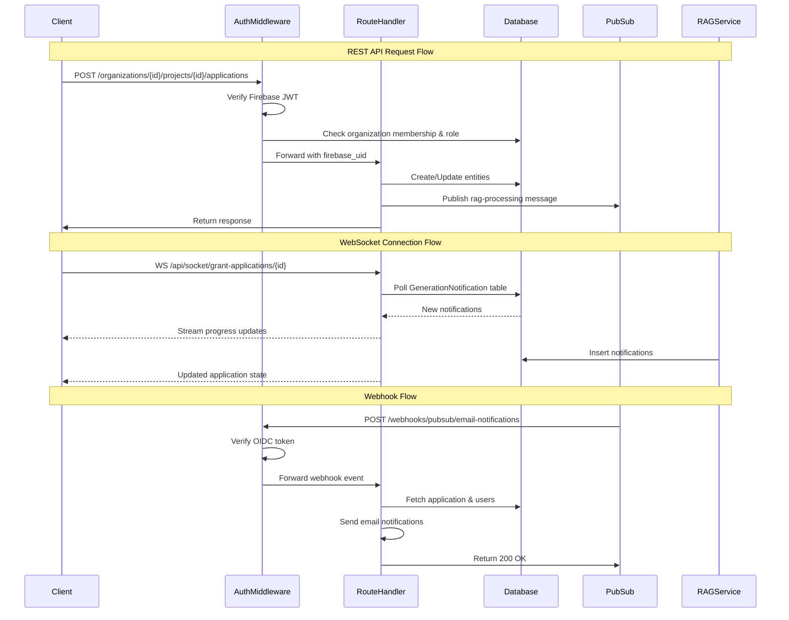

# Backend Service

Central REST API gateway for the GrantFlow.AI platform, providing Firebase authentication, multi-tenant organization management, and Pub/Sub orchestration of the document processing pipeline.

## Getting Started

For prerequisites, environment setup, and general development workflow, see the [Contributing Guide](../../CONTRIBUTING.md).

This README covers backend service-specific architecture and development details.

## Introduction

The backend service is the primary API gateway that coordinates all platform operations:

- **Authentication & Authorization**: Firebase JWT validation with organization-level claims
- **Multi-tenant Architecture**: Organization-based data isolation with role-based access control
- **API Gateway**: RESTful endpoints for all platform entities (organizations, projects, grant applications, templates)
- **Real-time Notifications**: WebSocket connections for RAG job progress updates
- **Service Orchestration**: Pub/Sub message publishing to indexer, crawler, and RAG services
- **Webhook Handlers**: OIDC-authenticated endpoints for email notifications, grant matching, entity cleanup

## Service Structure

```
services/backend/src/
├── api/
│   ├── middleware.py              # AuthMiddleware, TraceIdMiddleware
│   ├── routes/                    # 15 REST API route modules
│   │   ├── auth.py                # User authentication, login
│   │   ├── organizations.py       # Organization CRUD
│   │   ├── organizations_members.py
│   │   ├── organization_invitations.py
│   │   ├── projects.py            # Project management
│   │   ├── grant_applications.py  # Grant application lifecycle
│   │   ├── grant_templates.py     # Template generation
│   │   ├── granting_institutions.py
│   │   ├── grants.py              # Public grant search
│   │   ├── sources.py             # RAG source management
│   │   ├── rag_jobs.py            # RAG job monitoring
│   │   ├── files.py               # GCS signed URLs
│   │   ├── notifications.py       # Notification history
│   │   └── user.py                # User profile
│   ├── sockets/
│   │   └── grant_applications.py  # WebSocket for RAG progress
│   └── webhooks/
│       ├── email_sending.py       # /webhooks/pubsub/email-notifications
│       ├── grant_matcher.py       # /webhooks/scheduler/grant-matcher
│       └── entity_cleanup.py      # /webhooks/scheduler/entity-cleanup
├── utils/
│   ├── jwt.py                     # Firebase JWT verification
│   ├── oidc_auth.py               # Webhook OIDC token validation
│   ├── email.py                   # Email sending utilities
│   ├── docx.py                    # Document export
│   └── pdf.py                     # PDF generation
└── common_types.py                # Shared TypedDict definitions
```

## Operation Flow



## API Organization

### REST API Routes

All routes require Firebase JWT authentication unless noted as public.

**Authentication & Users**
- `/auth` - User login, token refresh
- `/user` - User profile management

**Organization Management**
- `/organizations` - Organization CRUD (multi-tenant isolation)
- `/organizations/{id}/members` - Member management (OWNER/ADMIN/COLLABORATOR roles)
- `/organizations/{id}/invitations` - Invitation system

**Project & Application Management**
- `/organizations/{id}/projects` - Project CRUD within organization context
- `/organizations/{id}/projects/{id}/applications` - Grant application lifecycle
- `/organizations/{id}/projects/{id}/applications/{id}/sources` - RAG source attachment
- `/organizations/{id}/rag-jobs` - RAG job status monitoring

**Grant Discovery & Templates**
- `/grants` - Public grant search (no auth required)
- `/granting-institutions` - Institution management (backoffice admin)
- `/organizations/{id}/templates` - Grant template generation

**File & Notification Management**
- `/organizations/{id}/files` - GCS signed URL generation
- `/organizations/{id}/notifications` - Notification history

### WebSocket Endpoints

- `/api/socket/grant-applications/{application_id}` - Real-time RAG job progress updates

### Webhook Endpoints

OIDC-authenticated endpoints for async service communication:

- `/webhooks/pubsub/email-notifications` - Email notifications when RAG jobs complete
- `/webhooks/scheduler/grant-matcher` - Periodic grant opportunity matching
- `/webhooks/scheduler/entity-cleanup` - Soft-delete cleanup tasks

## Integration Points

### Pub/Sub Topics (Publishes)

- **rag-processing** - Triggers RAG service for content generation
  - Payload: `{parent_type, parent_id, trace_id}`
  - Published from: grant_applications.py, grant_templates.py, sources.py

- **autofill-requests** - Triggers RAG autofill for specific fields
  - Payload: `{parent_id, autofill_type, field_name, context, trace_id}`
  - Published from: grant_applications.py

### Firebase Auth Integration

- **JWT Claims**: All authenticated requests include `firebase_uid`
- **Organization Context**: Routes extract `organization_id` from URL path
- **Role Verification**: AuthMiddleware validates `allowed_roles` decorator parameter
- **Project Access**: COLLABORATOR role checks ProjectAccess table for project-level permissions

### Google Cloud Storage

- **Signed URLs**: Generated via `/files` endpoint for client-side uploads
- **Document Storage**: PDFs, DOCX exports stored in organization-specific buckets

### PostgreSQL with pgvector

- **Async Sessions**: All database operations use SQLAlchemy 2.0 async session factory
- **Soft Deletes**: Uses `select_active()` helpers from packages.db.src.query_helpers
- **Vector Search**: pgvector extension for RAG similarity search (via RAG service)

## Notes

### Multi-tenant Security

All endpoints enforce multi-tenant isolation through:

1. **URL-based Organization Context**: `organization_id` required in path parameters
2. **Middleware Role Validation**: `@post('/path', allowed_roles=[UserRoleEnum.COLLABORATOR])`
3. **Database-level Filtering**: All queries scoped to `organization_id` from path
4. **Project-level Access Control**: COLLABORATOR role checks ProjectAccess table when `project_id` present

### Middleware Architecture

**AuthMiddleware** handles three authentication modes:

1. **Public Paths**: `/health`, `/schema`, `/grants` - no authentication
2. **Webhook Paths**: OIDC token validation with audience verification
3. **Authenticated Paths**: Firebase JWT validation + organization/role checks

**TraceIdMiddleware** provides distributed tracing:

- Extracts `X-Trace-ID` header or generates UUID
- Propagates to all database operations and Pub/Sub messages
- Enables request correlation across microservices

### Soft-Delete Pattern

All database queries use the `select_active()` helper to filter soft-deleted entities:

```python
from packages.db.src.query_helpers import select_active

stmt = select_active(GrantApplication).where(GrantApplication.id == application_id)
```

This pattern ensures deleted entities are excluded from all query results without manual `deleted_at IS NULL` checks.

### Real-time Notifications

WebSocket implementation uses polling pattern:

1. Client connects to `/api/socket/grant-applications/{id}`
2. Server polls `GenerationNotification` table every 3 seconds
3. New notifications pushed to client via WebSocket
4. Application state updates streamed in real-time
5. RAG service writes notifications to database during job execution
