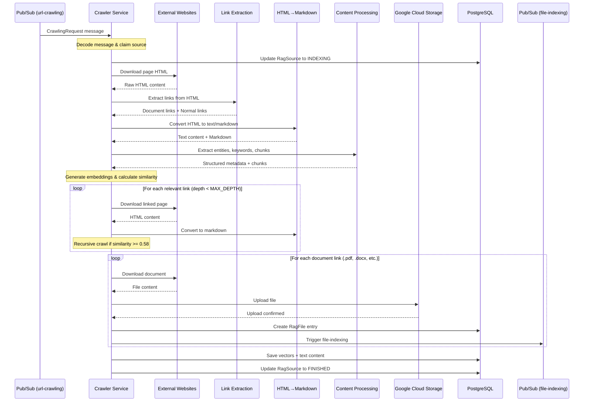

# Crawler Service

Web crawling service for extracting grant-related documents from URLs. The service listens to Pub/Sub messages, crawls web pages recursively with depth limiting and relevance filtering, extracts content and metadata using AI-powered extraction, and publishes indexed content for downstream RAG processing.

## Getting Started

For prerequisites, environment setup, and general development workflow, see the [Contributing Guide](../../CONTRIBUTING.md).

This README covers crawler service-specific architecture and development details.

## Service Structure

```
services/crawler/
├── src/
│   ├── __init__.py
│   ├── main.py                    # Litestar app + Pub/Sub handler
│   ├── extraction.py              # Core crawling logic
│   ├── utils.py                   # HTTP utilities + message decoding
│   ├── constants.py               # Configuration constants
│   └── dev_indexing_bypass.py    # Dev environment helpers
└── tests/
    ├── conftest.py
    ├── extraction_test.py
    ├── utils_test.py
    ├── url_deduplication_test.py
    ├── dev_indexing_bypass_test.py
    └── e2e/
        ├── crawler_pipeline_test.py
        └── url_extraction_test.py
```

## Operation Flow



## Processing Pipeline

### 1. Message Reception & Source Claiming
- Receives `CrawlingRequest` from `url-crawling` Pub/Sub topic
- Contains: `source_id`, `entity_type`, `entity_id`, `url`, `trace_id`
- Claims source by updating `RagSource.indexing_status` to `INDEXING` (prevents duplicate processing)
- If source already being processed or finished, exits early
- Handles stuck jobs (>10 minutes in INDEXING state)

### 2. Link Extraction
- Downloads HTML content using `httpx` (15s timeout)
- Parses with `BeautifulSoup` and sanitizes HTML
- Extracts all `<a>` tags and converts relative URLs to absolute
- Classifies links using regex pattern `FILE_RX`:
  - **Document links**: Match `\.(pdf|docx?|xlsx?|pptx?|txt|md|rtf)(?=$|[/?#])`
  - **Normal links**: All other HTTP/HTTPS links
- Filters out social media domains (x.com, twitter.com, facebook.com)

### 3. Content Extraction
- Uses `trafilatura` to convert HTML to clean markdown and text
- Generates embeddings using Vertex AI text-embedding-004 model
- Processes with Kreuzberg for:
  - Entity extraction (organizations, locations, people, grants)
  - Keyword extraction
  - Document classification
  - Content chunking (when enabled)
- Stores metadata including entities, keywords, and document classification

### 4. Depth-Limited Recursive Crawling
- Maximum depth controlled by `MAX_DEPTH` constant (default: 0 = no recursion)
- For each normal link at depth < MAX_DEPTH:
  - Downloads and extracts text content
  - Generates embeddings for the linked page
  - Calculates **cosine similarity** between main page and linked page embeddings
  - Recursively crawls if similarity >= 0.58 (relevant content)
- Uses in-memory session store to track visited URLs (prevents loops)
- URLs normalized before deduplication (trailing slashes, query params, fragments)
- Parallel processing of relevant links using `asyncio.gather()`

### 5. File Type Filtering & Download
- Controlled by `DOWNLOAD_FILES` environment variable (default: false)
- Filters document links by supported extensions:
  - PDF, DOCX, DOC, XLSX, XLS, PPTX, PPT, TXT, MD, RTF
- Downloads documents in parallel using `asyncio.gather()`
- Stores files in temporary directory during processing
- Each downloaded file creates:
  - New `RagSource` record (parent_id = original source)
  - `RagFile` record with GCS object path
  - Entity association (GrantingInstitutionSource/GrantApplicationSource/GrantTemplateSource)

### 6. GCS Upload & Indexing Trigger
- Constructs object path: `{entity_type}/{entity_id}/sources/{source_id}/{filename}`
- Uploads file bytes to Google Cloud Storage
- Creates `RagFile` database entry with object path and metadata
- In development: triggers file-indexing directly via internal function
- In production: file-indexing triggered by GCS object finalize event

### 7. Text Vectorization
- Combines markdown content from all crawled pages
- Re-processes combined content with Kreuzberg for final chunking
- Generates embeddings for each chunk using Vertex AI
- Creates `TextVector` records linked to source
- Stores enriched metadata (entities, keywords, classification)

### 8. Status Update
- Updates `RagSource.indexing_status` to `FINISHED` on success
- Updates to `FAILED` on error with error_type and error_message
- Retriable errors (network, timeout) keep status as FAILED for retry
- Non-retriable errors (validation, parsing) marked as FAILED permanently
- Tracks indexing duration via `indexing_started_at` timestamp

## Integration Points

### Pub/Sub Topics
- **Input**: `url-crawling`
  - Message format: `CrawlingRequest` TypedDict
  - Contains source_id, entity_type, entity_id, url, trace_id
  - Triggered by backend when user adds URL source

- **Output**: `file-indexing` (implicit via GCS events in production)
  - Triggered when file uploaded to GCS
  - Processed by Indexer service for content extraction

### Google Cloud Storage
- Bucket structure: `{entity_type}/{entity_id}/sources/{source_id}/{filename}`
- Stores downloaded documents (PDF, DOCX, etc.)
- Object finalize events trigger downstream indexing
- Files linked via `RagFile.object_path`

### PostgreSQL Tables
- **RagSource**: Main source record with indexing status and text content
- **RagUrl**: Stores URL metadata (not directly modified by crawler)
- **RagFile**: File metadata and GCS object path
- **TextVector**: pgvector embeddings for semantic search
- **Entity Junction Tables**: GrantingInstitutionSource, GrantApplicationSource, GrantTemplateSource

### External Services
- **HTTP**: Downloads HTML and files from target websites
- **Vertex AI Embeddings**: text-embedding-004 model for semantic similarity
- **Trafilatura**: Open-source HTML→text/markdown extraction
- **BeautifulSoup**: HTML parsing and link extraction
- **Kreuzberg**: AI-powered content processing (entities, keywords, chunking)

## Notes

### Recursive Depth Limits
- `MAX_DEPTH` environment variable controls crawl depth (default: 0)
- Depth 0: Only process initial URL, no following links
- Depth 1: Process initial URL + directly linked relevant pages
- Depth 2: Process initial URL + 2 levels of relevant links
- Prevents infinite crawling and excessive processing time
- Memory store tracks visited URLs to prevent cycles

### File Type Filtering
- Only processes files matching `FILE_RX` pattern
- Pattern: `\.(pdf|docx?|xlsx?|pptx?|txt|md|rtf)(?=$|[/?#])`
- Case-insensitive matching
- Validates extension exists in `SUPPORTED_FILE_EXTENSIONS` before upload
- Unsupported files silently skipped (logged at debug level)

### Robots.txt Compliance
- Currently **not implemented**
- Service does not check robots.txt before crawling
- Uses 15-second timeout to avoid hanging on slow sites
- Rate limiting via sequential processing (0.5s delay between requests implied by async operations)

### Deduplication Strategy
- URL normalization before deduplication:
  - Removes trailing slashes
  - Normalizes query parameter order
  - Removes URL fragments (#section)
- In-memory session store with 1-hour expiration
- Per-source session key: `visited_urls:{source_id}`
- Database-level deduplication via `RagSource` claiming pattern
- Parallel container safety via optimistic locking (UPDATE WHERE status IN [CREATED, FAILED])

### Similarity Threshold
- Cosine similarity threshold: **0.58**
- Compares embeddings between main page and linked pages
- Links with similarity >= 0.58 considered relevant and crawled
- Helps filter out navigation links, footers, unrelated content
- Threshold tuned empirically for grant-related content

### Error Handling
- **Retriable errors**: Network failures, timeouts, transient GCS errors
  - Status set to FAILED
  - Pub/Sub message acknowledged (will retry via exponential backoff)
- **Non-retriable errors**: Validation errors, parsing failures, invalid URLs
  - Status set to FAILED permanently
  - Error logged as warning (not exception)
  - Pub/Sub message acknowledged (no retry)
- Error details stored in `RagSource.error_type` and `error_message`
- Stuck job detection: Sources in INDEXING state for >10 minutes are reclaimed
