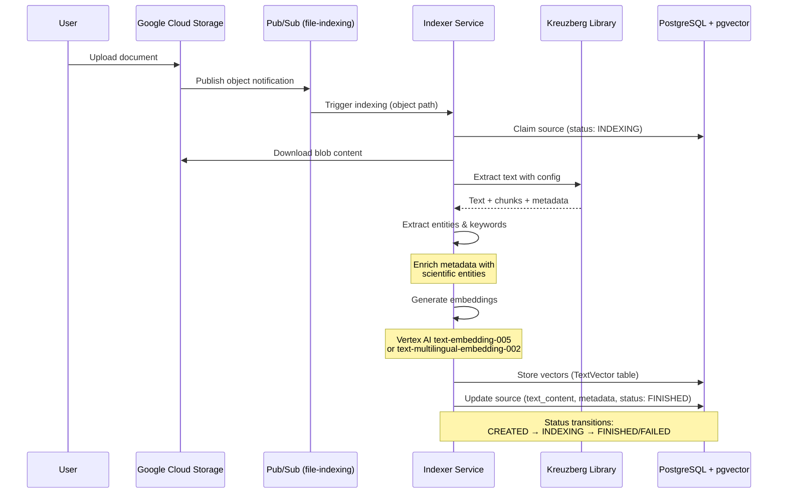

# Indexer Service

The Indexer Service is a Cloud Run microservice that processes uploaded documents through a comprehensive text extraction, entity recognition, chunking, and embedding generation pipeline. It transforms raw files (PDF, DOC, HTML) into searchable vector representations stored in PostgreSQL with pgvector, enabling intelligent document retrieval for the RAG system.

## Service Structure

```
services/indexer/
├── src/
│   ├── __init__.py
│   ├── main.py           # Pub/Sub handler, status management, stale detection
│   └── processing.py     # Core processing pipeline (extraction, chunking, embedding)
└── tests/
    ├── conftest.py
    ├── main_test.py
    ├── processing_test.py
    ├── metadata_persistence_integration_test.py
    └── e2e/
        ├── extraction_test.py
        ├── index_documents_test.py
        ├── indexer_functional_test.py
        ├── parse_and_index_file_test.py
        ├── ai_evaluation_test.py
        └── rag_evaluation_test.py
```

## Operation Flow



## Processing Pipeline

The indexer executes a five-stage pipeline for each uploaded document:

### 1. Text Extraction (Kreuzberg)
- Uses the **Kreuzberg** library via `extract_bytes()` with scientific extraction config
- Supports PDF, DOCX, HTML, and other MIME types
- Configurable token reduction (35% savings when enabled) for cost optimization
- Language hint support (default: English)
- Returns: extracted text, MIME type, chunks, and base metadata

### 2. Entity & Keyword Extraction
- Enriches document metadata with domain-specific entities
- Extracts scientific keywords relevant to grant applications
- Contextual extraction tied to document type and purpose
- Stores entity/keyword counts in structured metadata
- Supports document classification (grants, research papers, policies)

### 3. Text Chunking
- Intelligent chunking configured via `get_scientific_extraction_config(chunk_content=True)`
- Falls back to single-chunk strategy if chunking unavailable
- Converts chunks to `Chunk` DTOs for embedding generation
- Optimized for semantic coherence in scientific documents

### 4. Embedding Generation
- Generates vector embeddings via `index_chunks()` from `packages.shared_utils`
- Default model: Vertex AI `text-embedding-005`
- Alternative model: `text-multilingual-embedding-002` for multilingual content
- Returns `VectorDTO` objects with source_id association
- Tracks embedding duration for performance monitoring

### 5. Metadata & Vector Storage
- Stores extracted text in `RagSource.text_content` (PostgreSQL)
- Persists document metadata (entities, keywords, classification) in `RagSource.document_metadata`
- Inserts vectors into `TextVector` table with pgvector integration
- Updates indexing status to `FINISHED` or `FAILED` with error context
- Publishes status updates via `frontend-notifications` topic (when grant_application_id present)

## Integration Points

### Pub/Sub Topics
- **Consumes**: `file-indexing` topic
  - Triggered by GCS object notifications (OBJECT_FINALIZE events)
  - Receives object path: `{entity_type}/{entity_id}/sources/{source_id}/{blob_name}`
  - Attributes: `bucketId`, `objectId`, `eventType`, `customMetadata_trace-id`
- **Publishes**: `frontend-notifications` topic (via `update_source_indexing_status`)
  - Sends indexing status updates to frontend for grant applications
  - Includes status transitions and error notifications

### Google Cloud Storage
- Downloads blob content via `download_blob(object_path)`
- Object path format parsed by `parse_object_uri()`:
  - `entity_type`: grant_template | grant_application
  - `entity_id`: UUID of the entity
  - `source_id`: UUID of the RagSource
  - `blob_name`: Original filename

### PostgreSQL Tables
- **RagSource**: Source metadata, indexing status, text content, document metadata
- **RagFile**: File-specific information (filename, MIME type, size)
- **TextVector**: Vector embeddings with pgvector for similarity search
- **GrantTemplate**: Links sources to grant applications (via grant_application_id)

### Shared Utilities
- **Embeddings**: `packages.shared_utils.src.embeddings.index_chunks`
- **Extraction**: `packages.shared_utils.src.extraction` (config, entity/keyword enrichment)
- **Serialization**: `packages.shared_utils.src.serialization.serialize`
- **GCS**: `packages.shared_utils.src.gcs` (download, URI parsing)

## Notes

### Performance Characteristics
- **Token Reduction**: Enables ~35% reduction in token usage when `enable_token_reduction=True`
  - Reduces costs for downstream RAG processing
  - Configurable per source via extraction config
- **Dual Timing**: Tracks `extraction_duration` and `embedding_duration` separately for bottleneck analysis
- **Batch Operations**: Uses SQLAlchemy bulk inserts for vector storage

### Stale Indexing Detection
- **Threshold**: 10 minutes (`INDEXING_STALE_THRESHOLD`)
- **Behavior**: Reclaims sources stuck in `INDEXING` status beyond threshold
  - Updates `indexing_started_at` and `last_retry_at` timestamps
  - Clears previous error context (`error_type`, `error_message`)
- **Prevents**: Orphaned indexing jobs from blocking re-processing
- **Logging**: Warns when reclaiming stuck jobs with timestamp details

### Error Handling
- **Retriable Errors**: Sets status to `FAILED` but re-raises exception for Pub/Sub retry
  - Error category: `retriable` (determined by exception attribute)
  - Preserves error context in `RagSource` table
- **Non-Retriable Errors**: Sets status to `FAILED` and acknowledges message
  - Logs warning with error category and type
  - Prevents infinite retry loops
- **Duplicate Messages**: Handled via status transitions (idempotent)
  - `FINISHED` sources skip re-processing
  - `INDEXING` sources checked for staleness before skipping

### Idempotency & Concurrency
- **Status Locking**: Uses optimistic locking via `update().where(status.in_([CREATED, FAILED]))`
  - Only one container claims a source for indexing
  - Returns early if another container already claimed
- **Duplicate Handling**: Safely handles duplicate Pub/Sub messages
  - Already-finished sources return immediately
  - Already-indexing sources checked for staleness
- **Grant Application Linking**: Supports indexing for grant_template and grant_application entities
  - Resolves grant_application_id from GrantTemplate when needed
  - Publishes notifications only when grant_application_id present
