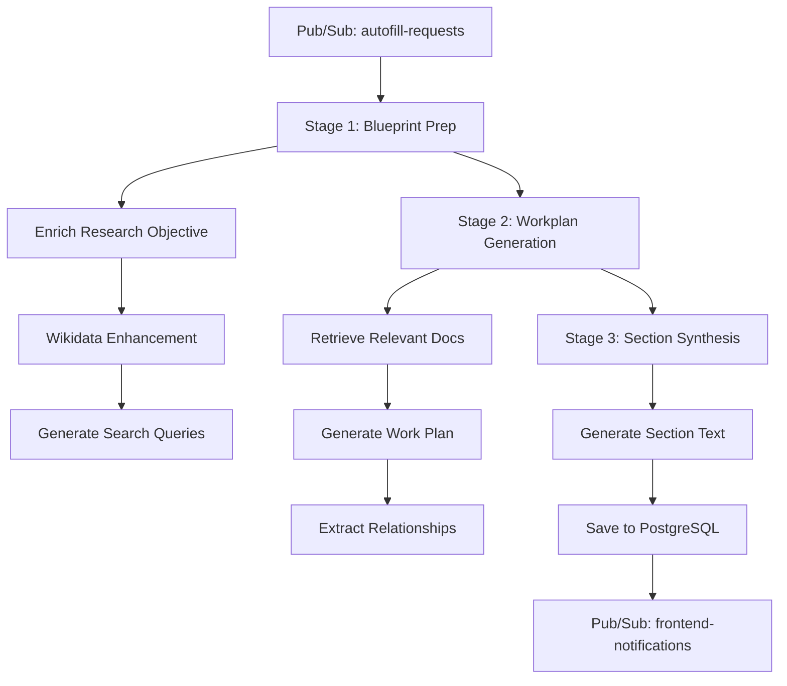
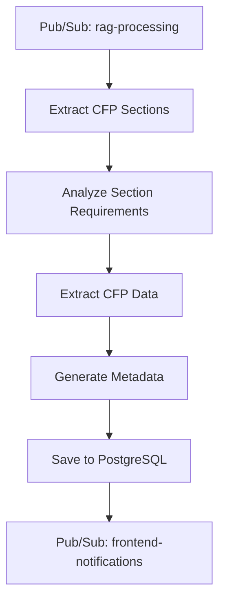
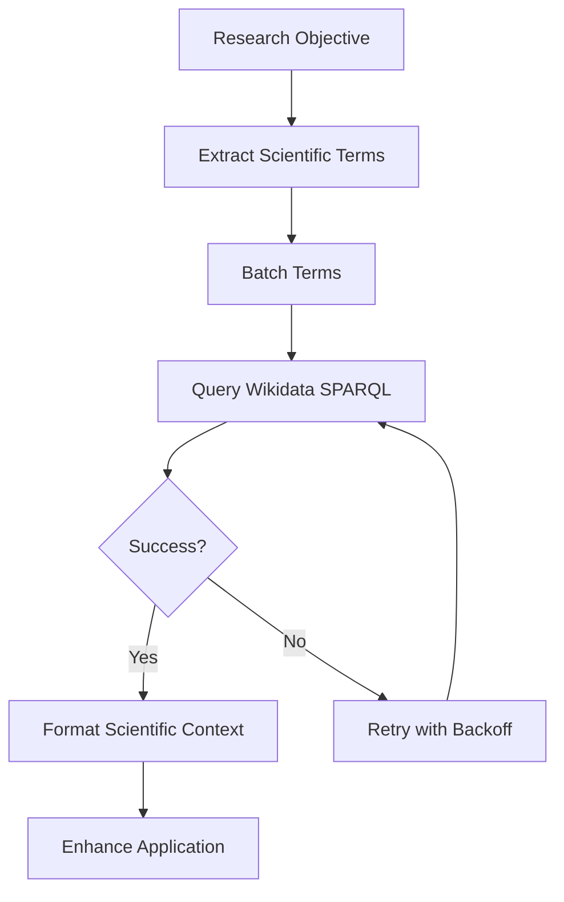

# RAG Service

## Introduction

The RAG (Retrieval-Augmented Generation) service processes grant documents to extract structured templates and generates complete grant applications using LLMs with retrieval from indexed documents. The service integrates Wikidata-enhanced scientific context to improve the quality and scientific accuracy of generated applications.

Core capabilities:
- **Grant Template Extraction**: Extracts structured templates from call-for-proposals (CFP) documents, identifying required sections, length constraints, and evaluation criteria
- **Grant Application Generation**: Generates complete grant applications using a multi-stage pipeline that combines document retrieval, scientific context enhancement, and LLM-powered synthesis
- **Wikidata Enhancement**: Enriches research objectives with scientific context from Wikidata's knowledge base, expanding scientific terms and providing authoritative references

## Service Structure

```
services/rag/
├── src/
│   ├── grant_template/         # CFP template extraction
│   │   ├── extract_sections.py
│   │   ├── cfp_section_analysis.py
│   │   ├── extract_cfp_data.py
│   │   └── generate_metadata.py
│   ├── grant_application/      # Application generation pipeline
│   │   ├── enrich_research_objective.py
│   │   ├── generate_work_plan.py
│   │   ├── generate_section_text.py
│   │   └── extract_relationships.py
│   ├── autofill/               # Autofill request handling
│   │   └── process_autofill.py
│   └── utils/                  # Shared utilities
│       ├── wikidata_client.py
│       ├── format_scientific_context.py
│       └── llm_clients.py
└── tests/
    ├── grant_template/
    ├── grant_application/
    ├── utils/
    └── benchmarks/
```

## Operation Flow

### Grant Application Pipeline



### Grant Template Extraction



### Wikidata Enhancement



## Processing Stages

### Grant Template Extraction
1. **Section Extraction**: Identifies all required sections in CFP document, distinguishing between research plan and supporting sections
2. **Requirement Analysis**: Analyzes each section for length constraints, evaluation criteria, and formatting requirements
3. **Data Extraction**: Extracts structured data including submission deadlines, funding amounts, and eligibility criteria
4. **Metadata Generation**: Generates searchable metadata for template discovery and matching

### Grant Application Generation
1. **BLUEPRINT_PREP**: Enriches research objective with scientific context from Wikidata, extracts core terms, generates guiding questions and search queries
2. **WORKPLAN_GENERATION**: Retrieves relevant documents, generates comprehensive work plan with tasks and milestones, extracts dependencies between tasks
3. **SECTION_SYNTHESIS**: Generates final section text using work plan, retrieved documents, and CFP requirements

## Integration Points

### Pub/Sub Topics
- **rag-processing**: Receives grant template extraction requests
- **autofill-requests**: Receives grant application generation requests
- **frontend-notifications**: Publishes completion notifications to frontend

### PostgreSQL
- **grant_templates**: Stores extracted CFP templates with sections and requirements
- **grant_applications**: Stores generated applications with section content
- **research_objectives**: Stores enriched objectives with scientific terms
- **work_plans**: Stores generated work plans with tasks and dependencies

### Wikidata SPARQL
- **Endpoint**: `https://query.wikidata.org/sparql`
- **Batch Processing**: 5 terms per batch for optimal performance
- **Retry Logic**: 3 attempts with exponential backoff
- **Timeout**: 30 seconds per request

### LLM Providers
- **Gemini 2.5 Flash**: Primary model for structured extraction and generation (1M context window)
- **Claude 3.5 Sonnet**: Secondary model for complex reasoning tasks
- **Vertex AI**: Managed model deployment with rate limiting and retry logic

## Notes

### JSON Schema Design Principles

All JSON schemas for Gemini structured output follow **official Google best practices** to minimize token usage and improve model reliability:

#### Core Principles
1. **Short Property Names**: Single words preferred (`name`, `type`, `source`, `quote`) not verbose (`section_name`, `measurement_type`, `cfp_source_reference`, `quote_from_source`)
2. **Minimal Nesting**: Max 2 levels deep, flatten arrays where possible
3. **Reduced Required Fields**: 2-6 required fields per object, use `NotRequired` for rest
4. **Object Arrays Over Tuples**: Always use named properties `[{source, target, desc}]` not `[["s","t","d"]]`
5. **Concise Descriptions**: 1-2 sentences max in schema, move details to prompts
6. **Strategic Constraints**: Use `minItems/maxItems` (3-10 typical), avoid over-constraining
7. **Property Ordering**: Match example order in prompts

#### Optimization Pattern

RAG service uses optimized short property names throughout the pipeline. Conversion to database column names happens only at the database boundary when saving to tables.

```python
# Optimized schema for Gemini
schema = {
    "properties": {
        "name": {"type": "string"},
        "quote": {"type": "string"},
        "source": {"type": "string"}
    },
    "required": ["name", "quote"]
}

# LLM returns optimized format
response = {"name": "Research Plan", "quote": "...", "source": "..."}

# Use short names throughout RAG service
section = ExtractedSectionDTO(
    title=response["name"],
    ...
)

# Convert to DB format only when saving to database tables
```

#### Property Name Mapping

| DB Schema (Descriptive) | Pipeline Schema (Optimized) | Token Savings |
|-------------------------|----------------------------|---------------|
| `section_name` | `name` | 50% |
| `quote_from_source` | `quote` | 70% |
| `cfp_source_reference` | `source` | 70% |
| `is_detailed_research_plan` | `is_plan` | 50% |
| `enriched_objective` | `enriched` | 50% |
| `core_scientific_terms` | `terms` | 60% |
| `guiding_questions` | `questions` | 50% |
| `search_queries` | `queries` | 40% |
| `sections_count` | `count` | 60% |
| `length_constraints_found` | `constraints_count` | 50% |

#### Schema Example: Before and After

**Before (verbose)**:
```python
{
    "is_detailed_research_plan": {"type": "boolean"},
    "needs_applicant_writing": {"type": "boolean"},
    "length_limit": {"type": "integer", "nullable": True},
    "length_source": {"type": "string", "nullable": True}
}
```

**After (optimized)**:
```python
{
    "is_plan": {"type": "boolean"},
    "needs_writing": {"type": "boolean"},
    "length_constraint": {
        "type": "object",
        "nullable": True,
        "properties": {
            "type": {"type": "string", "enum": ["words", "characters"]},
            "value": {"type": "integer", "minimum": 1},
            "source": {"type": "string", "nullable": True},
        },
        "required": ["type", "value", "source"],
    }
}
```

#### Business Logic Preservation

All validation logic uses short property names:

- **extract_sections.py**: Exactly 1 section with `is_plan=true`, research plan must have `long_form=true`
- **enrich_research_objective.py**: Exactly 5 `terms`, minimum 3 `questions`, minimum 3 `queries`
- **cfp_section_analysis.py**: `count` must match `required_sections` array length, `constraints_count` must match `length_constraints` array length
- **extract_relationships.py**: Tuple arrays replaced with object arrays `[{source, target, desc}]`

### Prompt Engineering Guidelines

All RAG prompts target **Gemini 2.5 Flash** (1M context, thinking mode) and follow official best practices:

#### Core Principles
1. **Concise & Clear**: State instructions once, no repetition or shouting (ALL CAPS)
2. **NO JSON Examples in Prompts**: Schema provides structure, prompt provides context only
3. **Hierarchical Structure**: Use `## headers` and numbered lists for organization
4. **Professional Tone**: Avoid emoji warnings and excessive emphasis

#### JSON Output Prompts
- Provide JSON schema separately (see `*_json_schema` constants)
- **DO NOT include JSON examples in prompts** - schema is sufficient
- Focus prompt on task description and requirements
- Structure: Task → Requirements → Schema reference (no examples)

Example files: `extract_sections.py`, `cfp_section_analysis.py`, `generate_metadata.py`, `extract_cfp_data.py`

#### Text Output Prompts
- Structure: Requirements → Materials → Guidelines → Format
- Keep under 50 lines for simple tasks, under 100 for complex
- Use model's thinking mode (don't prescribe chain-of-thought)

Example files: `generate_section_text.py`

#### Token Budget Guidelines
- **System prompts**: < 30 lines (state role and key constraints)
- **User prompts**: < 100 lines for complex tasks, < 50 for simple
- **NO JSON examples**: Schema-only approach saves 200-500 tokens per prompt
- **Total prompt tokens**: Target < 500 tokens per prompt (excluding input data)

#### Anti-Patterns to Avoid
- Massive verbose prompts (>400 lines)
- JSON examples in prompts (schema is sufficient)
- Repetitive instructions
- Emoji warnings and excessive ALL CAPS
- Contradictory or overlapping instructions
- Prescriptive chain-of-thought (model has thinking mode)
- Tuple arrays instead of object arrays

#### Prompt Refactoring Checklist
1. Remove all repetition (say things once)
2. **Remove ALL JSON examples** - schema provides structure
3. Consolidate overlapping sections
4. Remove emoji warnings and excessive caps
5. Verify JSON schema uses short property names
6. Add transformation layer if schema changed
7. Test with validation logic to ensure compatibility

### Wikidata Enhancement

The service integrates Wikidata's scientific knowledge base to enrich grant applications with authoritative scientific context.

#### Implementation
- **Client**: Function-based httpx client with no context manager overhead
- **Configuration**: Constants-based (no environment variables): batch size 5, timeout 30s, max retries 3
- **Processing**: Batch processing with exponential backoff retry logic
- **Integration**: Enriches research objectives in BLUEPRINT_PREP stage

#### Performance Metrics
- **Processing Speed**: < 5 seconds for typical scientific term sets (10 terms)
- **Scalability**: Handles 5-50 terms efficiently with batch processing
- **Reliability**: 95%+ success rate with retry mechanisms
- **Throughput**: > 0.1 terms/second
- **Success Rate**: > 80% success rate

#### Scientific Context
- **Term Coverage**: 10/10 scientific terms detected
- **Context Relevance**: 100% relevant scientific context
- **Field Organization**: Organized by scientific field for better LLM consumption
- **Template-based**: Uses prompt template library for consistent formatting

### Quality Improvements

AI evaluation results demonstrate significant improvements from Wikidata enhancement:

#### AI Evaluation Results
- **Baseline Quality**: 4.0/5.0
- **Wiki-Enhanced Quality**: 5.0/5.0 (+25% improvement)
- **Scientific Terms**: 10% → 100% coverage (+900% improvement)
- **All Criteria**: +1.0 point improvement across all evaluation dimensions

#### Scientific Accuracy
- **Term Detection**: 100% (10/10 scientific terms identified)
- **Context Relevance**: 100% relevant scientific context from Wikidata
- **Structured Organization**: Context organized by scientific field for optimal LLM processing
- **Quality Metrics**: Comprehensive AI evaluation with statistical analysis
