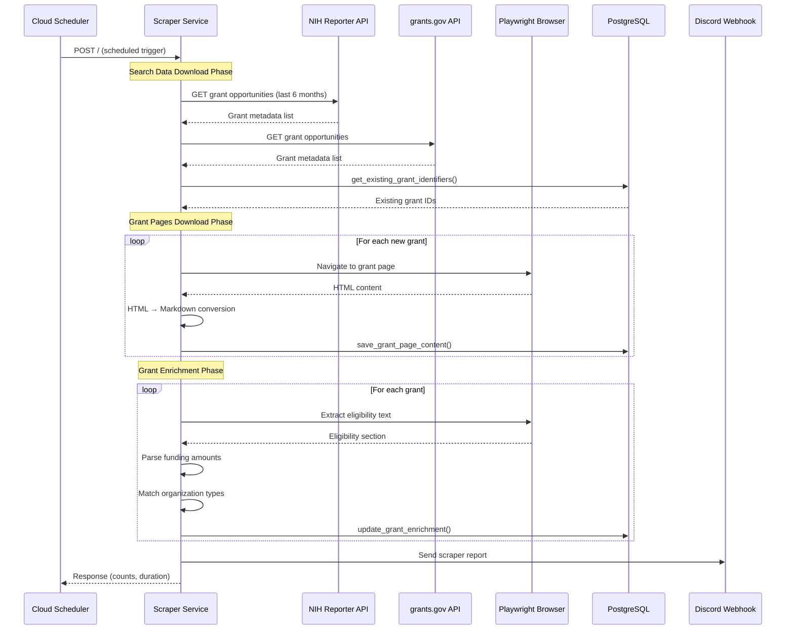
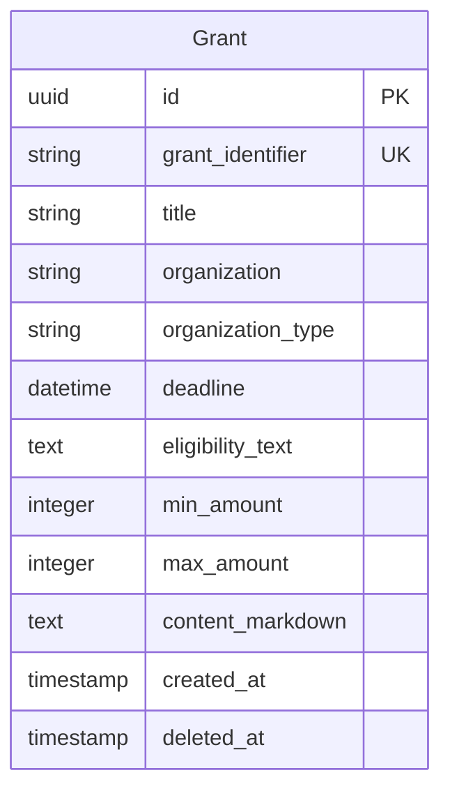

# Scraper Service

Automated grant opportunity discovery service that retrieves funding opportunities from NIH and grants.gov, enriches them with eligibility and funding information, and stores them in PostgreSQL.

## Service Structure

```
services/scraper/
├── src/
│   ├── main.py                 # Litestar app entry point
│   ├── search_data.py          # NIH/grants.gov API integration
│   ├── grant_pages.py          # Playwright-based page download
│   ├── grant_enrichment.py     # Eligibility/amount extraction
│   ├── utils.py                # Database operations
│   └── constants.py            # Configuration constants
├── tests/
│   ├── grant_enrichment_test.py
│   ├── grant_pages_test.py
│   ├── search_data_test.py
│   └── utils_test.py
└── pyproject.toml
```

## Operation Flow



## Processing Pipeline

### 1. Search Data Download

Retrieves grant opportunity metadata from external APIs:
- **NIH Reporter API**: National Institutes of Health grants
- **grants.gov API**: Federal government opportunities
- **Date Range**: Configurable (default: last 6 months)
- **Pagination**: Automatic handling of large result sets
- **Deduplication**: Checks against existing database records

### 2. Grant Pages Download

Uses Playwright browser automation to download full grant pages:
- **Page Load**: 30-second timeout with 2-second wait
- **HTML Processing**: Converts to Markdown for storage
- **Selective Download**: Only processes new grants identified in step 1

### 3. Grant Enrichment

Extracts structured data from grant pages:

**Eligibility Extraction:**
- Locates eligibility sections using Playwright selectors
- Extracts text describing eligible organization types
- Matches against 20+ predefined categories (Higher Education, Healthcare, Government, Nonprofits, etc.)

**Funding Amount Parsing:**
- Identifies dollar amounts in grant text
- Filters amounts between $10K-$10M thresholds
- Uses median-based algorithm (5x multiplier) to determine min/max ranges
- Collects up to 10 amounts per grant

## Database Schema



## Integration Points

### External APIs
- **NIH Reporter**: Search grants by date range
- **grants.gov**: Federal grant opportunities

### Internal Services
- **Database**: Direct PostgreSQL operations (no Pub/Sub)
- **Discord**: Webhook notifications for scraper reports

### Deduplication Strategy
Uses `ON CONFLICT DO NOTHING` pattern based on `grant_identifier` to prevent duplicate entries.

## Notes

### Performance Characteristics
- Typical run: 100 grants in 2-3 minutes
- Bottleneck: Playwright page loads (rate-limited by browser)
- Scaling: Runs with concurrency=1 on Cloud Run (exclusive processing)

### Deployment Pattern
- **Trigger**: Cloud Scheduler (configurable frequency)
- **Memory**: 2Gi (required for Playwright browser)
- **Timeout**: 10 minutes
- **Retry**: 2 attempts with 120s max duration

### Key Constants

```python
PAGE_LOAD_TIMEOUT_MS = 30000      # 30 seconds
MIN_AMOUNT_THRESHOLD = 10000       # $10K minimum
MAX_AMOUNT_THRESHOLD = 10000000    # $10M maximum
MAX_AMOUNTS_TO_COLLECT = 10        # Sample up to 10 amounts
MEDIAN_MULTIPLIER = 5              # 5x median for range
```

### Supported Organization Types
Higher Education, Healthcare, Government (Federal/State/Local), Nonprofits (501c3/Other), For-Profit Businesses, International Organizations, and more.
